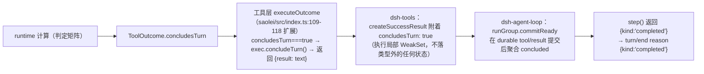
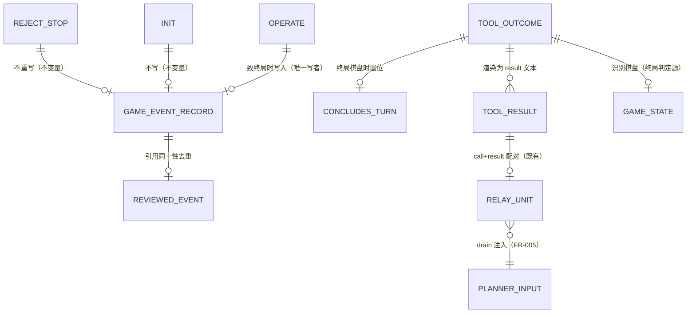

# Data Model: 062-team-game-end-handoff

**输入**: [spec.md](spec.md) FR-001~006 / Key Entities、[research.md](research.md) D1/D2/D4。
本 feature 唯一的契约级数据变更：`ToolOutcome` 扩展一个可选收束标记；其余实体（`GameEventRecord`、turn 终态、relay 单元）**零结构变更**，此处固化其与本 feature 相关的行为不变量（防实现漂移）。

---

## 1. ToolOutcome（扩展）

`common/js/dsh-plugins/saolei-loop/src/game/runtime.ts:90-92` 既有类型，成功分支增加可选字段：

```ts
export type ToolOutcome =
  | { isError: false; text: string; concludesTurn?: true }
  | { isError: true; error: { message: string } };
```

### 1.1 字段语义

- **`concludesTurn?: true`**（仅成功分支）：该结果的识别棋盘为终局（`gameStatus(state) ∈ {won, lost}`）的声明。纯内容驱动、无状态——计算只依赖本次返回的结果棋盘，不依赖也不影响 `gameEvent`/`reviewedGameEvent`/编排队列（spec FR-001 无条件条款）。可选且仅在置位时出现（`true`），playing/无棋盘结果不携带该键。
- 错误分支类型上保持不可携带（对齐 dsh `ToolExecutionFailure.concludesTurn?: never`，`@deepseek-ai/dsh-tools` `lib/types/index.d.ts:400-409`）——isError 不收束由类型保证而非约定。

### 1.2 判定矩阵（runtime 全部返回路径）

单一谓词：**返回文本所对应的识别棋盘状态是否终局**。逐路径映射（行号为现状，`runtime.ts`）：

| # | 路径 | 现状位置 | 结果棋盘 | `concludesTurn` | 依据 |
|---|---|---|---|---|---|
| 1 | init：desktop dispatch FAILED | `:194-196` | 无（isError） | — | FR-001 失败不收束 |
| 2 | init：识别失败 | `:198-200` | 无 | 不置位 | 无棋盘 |
| 3 | init：成功 | `:205` | 识别出的 state | `gameStatus(state)` 终局时置位 | FR-002 ①（init 即终局） |
| 4 | operate：空操作列表且无识别 | `:220-223` | 无 | 不置位 | `no_active_game` |
| 5 | operate：空操作列表且有识别 | `:224-227` | recognized | 终局时置位 | FR-002 泛化面（返回终局棋盘的成功结果） |
| 6 | operate：批内 dispatch FAILED | `:254-255` | 无（isError） | — | FR-001 失败不收束 |
| 7 | operate：批内识别失效 | `:256-259` | 无 | 不置位 | `unable to recognize board` |
| 8 | operate：批后无识别（防御分支） | `:263-266` | 无 | 不置位 | 同 4 |
| 9 | operate：正常返回 | `:287-290` | finalState | `gameStatus(finalState)` 终局时置位 | FR-001（致终局 op）+ FR-002 ②（终局棋盘结构性拒绝，stop 分支的 finalState 即终局棋盘） |
| 10 | remain | `:294-299` | 不适用 | **永不置位** | FR-002 排除（只读） |
| 11 | 参数组合拒绝（工具层，不进 runtime） | `saolei/src/index.ts:219-223` | 无 | 不置位 | 无棋盘 |

矩阵即 SC-004 单测断言面（runtime 侧 10 行在 `runtime.test.ts`；第 11 行工具层参数组合拒绝在 `index.test.ts`）。实现建议：标记计算收敛为单一 helper（输入 state，输出 `{concludesTurn?: true}`），在 #3/#5/#9 三个置位点复用——避免逐路径手写导致矩阵漂移。

### 1.3 消费链（数据流）



消费链上每一环均既有（dsh 物化源码证据见 [research.md](research.md) D1）；本 feature 只点亮第一、二环。

## 2. GameEventRecord（零结构变更，行为不变量固化）

既有实体（`runtime.ts:112-118`；051 data-model.md §2.5）。本 feature 相关不变量：

- **写入**：仅致终局的 operate（`endedStatus !== null`，`:277-285`）。init 不写；对终局棋盘的结构性拒绝不写（stop 分支不置 `endedStatus`，`:250-253`）。
- **同一性**：`this.gameEvent` 槽位持有 LATEST 记录的**对象引用**；未被新终局覆盖前引用不变——这是编排器 `event !== this.reviewedGameEvent`（`orchestrator.ts:796-797`，引用比较）去重的生效前提，也是"同一局不重复切换"（spec Session 裁定一）的数据基础。
- **消费**：编排器 `peekGameEvent()` 只读；复盘登记后 `reviewedGameEvent = step.review`（`orchestrator.ts:712`）。刷新重置为 null（`:434`）。
- **生命周期时序**：写入发生在 operate 返回**之前**（同一次调用内）——终局结果提交时终局记录已可读，turn 收束 → idle → 评估无丢失窗口。

## 3. turn 终态（可观测契约，dsh 拥有）

本 feature 不改 turn 状态机，固化三态的可观测差异（FR-003 验收面）：

| 终态 | turn/end reason | session log 形态 | webUI turn_end |
|---|---|---|---|
| 终局收束（本 feature） | `{kind:"completed"}` | assistant/message（含 tool-call）→ tool/call → tool/result（终局）→ step/end → turn/end；**无后续模型调用** | `TURN_STATUS_COMPLETED` |
| 自然停手（既有） | `{kind:"completed"}` | 同上，但 tool/result 后可有无工具调用的收尾 assistant 文本 | `TURN_STATUS_COMPLETED` |
| cancel/abort（既有，零改动） | `{kind:"aborted", reason}` | `interrupted: true` assistant message、未启动调用合成错误结果 | CANCELED/ABORTED |

前两行唯一差异即"终局步之后无收尾文本"——用户裁定的等价目标（spec 用户裁定"无痕性"）。`concludesTurn` 不落 durable 事件：session log 中不存在任何可区分"收束"与"自然停手"的字段（FR-003 无痕性的数据面表述）。

## 4. 收束-判定-切换全流程（状态视角）

完整流程图见 [spec.md](spec.md) 终局处理流程总览（Mermaid，三层：工具层无条件标记 → turn 无痕终止 → saolei-loop idle 双分支）。数据视角的边沿不变量：

- **排队消息（编排 FIFO）**：不进入 agent 侧 next-step inbox；终局 turn 照常结束，idle 分支消化（`orchestrator.ts:772-779`）——消化 turn 的模型输入经 `deriveMessages()` 自然含终局 tool call+result（FR-005 下半）。其他排队输入机制与终局边界的交互语义不在本 feature 范围（无冲突保证见 spec Assumptions"061 关系"）。

## 5. 实体关系（本 feature 视角）


