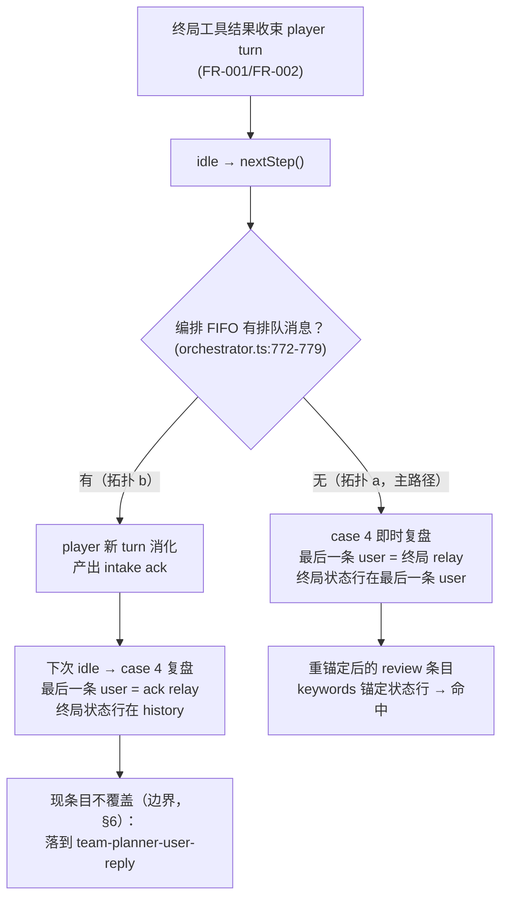

# Plan Addendum 02: planner review 夹具重锚定——"team_planner.yaml 零改动"假设证伪

**Feature**: 062-team-game-end-handoff
**日期**: 2026-09-12
**性质**: 设计补充（执行期实证发现）。plan.md/research.md D6 的 "`team_planner.yaml` 零改动" 假设被证伪；本 addendum 决定 review 条目的最终匹配条件，并给出夹具/锁步/文档同步的逐文件处方。**不触碰生产代码**（编排器/team/relay 零改动面不变，FR-004）。

**输入**: [spec.md](spec.md)（SC-003、FR-004、FR-005、US3/US4、Edge Cases 排队消息节）、[plan.md](plan.md)（Project Structure :82）、[research.md](research.md) D6、[tasks.md](tasks.md) T011、[plan-addendum-01-t013-regression-gaps.md](plan-addendum-01-t013-regression-gaps.md)、`projects/game/fake-llm/service/responses.go`、`projects/game/fake-llm/service/testdata/team_planner.yaml` / `team_player.yaml`、`projects/game/fake-llm/service/message_store_test.go`、`common/js/dsh-plugins/saolei-loop/src/orchestrator.ts`。

---

## 0. 结论摘要

**决定**: `team_planner.yaml` 的 `team-planner-review-continue` / `team-planner-review-stop` 两条目**就地重锚定**——`keywords` 从 player 广播 markers 改为终局状态行原文（`"game status: won"` / `"game status: lost"`），**移除 `history_keywords`**；`system_keywords` / `min_turn: 2` / `text` / `tool_call` 全部不变。条目数、条目名、排序、Go 常量、大型测试文本断言**零变化**（`message_store_test.go` 仅同步两处锚定断言与注释）。

**归属**: T011 描述修订承载（见 §4），不新增 task ID。

---

## 1. 语义基准与证据链

### 1.1 fake-llm 多轮匹配语义（源码，`projects/game/fake-llm/service/responses.go`）

| 条件 | 语义 | 源码 |
|---|---|---|
| `keywords` | **ANY** 命中（大小写不敏感子串）**最后一条 user 消息** | `matchResponsesMultiTurn` :290-292 |
| `history_keywords` | **每个**关键词须命中"**除最后一条 user 消息外**"的任意历史消息（user 或 assistant 均可） | `allHistoryKeywordsHit` :359-376、`loweredResponsesHistory` :378-391 |
| `system_keywords` | 全部命中请求 `instructions`（组装后 system prompt） | :350-357 |
| `min_turn` | 请求内 user 角色消息总数 ≥ min_turn（`userTurnCount` :414-423） | :299 |
| 组合 | 各条件 AND；多轮条目间冲突取**声明条件数降序、名字升序** | `moreSpecificResponses` :316-323 |

字段契约文档：[specs/047-dsh-chat-demo/contracts/fake-llm-templates.md](../../047-dsh-chat-demo/contracts/fake-llm-templates.md) §2/§3（Responses 投影见 specs/049-agent-v2-dsh-init/contracts/fake-responses-wire.md §3）。

### 1.2 062 后的 review 驱动输入（两个拓扑）

review 驱动经编排器 case 4（`orchestrator.ts:796-805`）`drain(planner)` 取 player 未消费广播单元，`drive()` 以 `inject` 前 n-1 + `followup` 最后一条注入（`orchestrator.ts:820-852`）——**最后一条 user 消息 = drain 的最后一个单元**：

| 拓扑 | 触发条件 | drain(planner) | 最后一条 user 消息 | 终局状态行位置 |
|---|---|---|---|---|
| **(a) 即时复盘**（062 主路径） | 队列空、终局 turn 收束即 case 4 | `[init relay, 终局 operate relay]`（062 收束下无总结文本，player 终局 turn 产出仅此二单元） | **终局 operate relay**（`<player-tool-call>` 包裹，result 含 `game status: won/lost` 原文） | **最后一条 user 消息内** → `history_keywords` 不可见 → 现规则 miss |
| **(b) 排队消化后复盘**（边界） | 终局步前用户消息已入编排 FIFO（case 1 `orchestrator.ts:772-779` 优先）→ player 先消化（ack 文本为其 turn 最后产出）→ 下次 idle 才 case 4 | `[init relay, 终局 relay, intake ack relay]` | **intake ack relay**（`<player-message>` 包裹 `team-player-user-intake` 文本） | 历史（终局 relay 在 pre-last-user history） → 现规则**能**命中 |



**dsh 侧 user 计数口径**：`userTurnCount` 统计请求内全部 user 角色消息（`responses.go:414-423`）。拓扑 (a) 的 review 请求 = `[user(start), assistant(opening), user(init relay), user(终局 relay)]` → 3 ≥ `min_turn 2` ✓（多局累积只增不减）。

### 1.3 假设证伪（执行期实证 + 语义推导）

- research.md D6 原判断"review 条目锚定 history_keywords（relay 内工具结果原文）而非总结文本，移除总结不破坏 planner 脚本"隐含前提：**终局结果位于 pre-last-user history**。该前提只对 059 形态（player 终局后输出总结文本收尾 → 最后一条 user = 总结 relay，`team_planner.yaml:22-30` 原注释明文描述该拓扑）与拓扑 (b) 成立。
- 062 语义下总结文本不再产生（终局工具结果收束 turn），拓扑 (a) 的最后一条 user 即终局 relay → `history_keywords` 永不命中。developer 已用真实 fake-llm 服务实证：新拓扑落到确定性兜底模板（`matchResponses` 优先级 3，`responses.go:273-279`）——`TerminalWon/TerminalLost` 的 `turns[2]` 文本断言必红。
- 旧拓扑（总结 relay 存在）实证命中——与 1.2 表格推导一致。

### 1.4 拓扑 (b) 的大型测试覆盖审计（核对结论：**零覆盖**）

全部 `teamQueueMessage`（`agent_v2_helpers_test.go:61`，"稍等，继续按计划观察"）使用点逐例核对：

| 测试 | 排队时序 | 是否触及"消化后复盘" |
|---|---|---|
| `TestAgentV2TeamQueueDigestPriority`（`agent_v2_conversation_test.go:314-393`） | planner-wait 长回合在途（无游戏、无 gameEvent） | 否——消化者为 planner，断言 `teamPlannerUserReplyText` |
| `TestAgentV2TeamCancelPausesAndSendResumes`（:400-471） | planner-wait + Cancel | 否 |
| `TestAgentV2TeamRefreshTerminatesInFlightAndClears`（:478-519+） | planner-wait + Refresh | 否 |
| `TestAgentV2TeamViewDataProjections`（:173-306，第二次 Send :293） | 4-turn 链静止后（game 2 init-terminal 不写 gameEvent，无 pending review） | 否——消化者为静止中的 player，断言仅 user→user 在场 |
| `TestAgentV2TeamGameDesktopAbsent`（`agent_v2_game_test.go:382`） | init isError（无游戏）后 | 否 |
| `TestAgentV2TeamGameMultiSessionIsolation`（:398-471，无 teamQueueMessage） | connected 会话 init-terminal 无 gameEvent | 否 |

**结论**: 没有任何测试走到"player 消化排队消息 → 下一次 idle gameEnded 复盘"。拓扑 (b) 是 spec Edge Cases / US4 Acceptance Scenario 2 / FR-004 文档化的合法行为，但当前无断言面。

---

## 2. 方案决定：两条目就地重锚定（keywords 锚定终局状态行）

### 2.1 决定内容

`team_planner.yaml` 两条 review 条目：

| 字段 | 旧值（059 形态） | 新值（终态） |
|---|---|---|
| `keywords` | `["<player-message>", "<player-tool-call>"]` | `["game status: won"]`（continue）/ `["game status: lost"]`（stop） |
| `history_keywords` | `["game status: won"]` / `["game status: lost"]` | **移除** |
| `system_keywords` / `min_turn` / `text` / `tool_call` | — | **不变**（`你是扫雷 planner` / 2 / 同文本 / memory add 同参数） |

**Rationale**:

1. **主路径正确且自证**: 拓扑 (a) 的最后一条 user 就是终局 relay，keywords（ANY-最后一条）直接锚定其内的状态行原文——条目命中本身即 SC-003 断言（"复盘输入含终局单元"）的机制证明，且比 history 锚定**更强**（证明的是最后一条 user 携带该单元，而非仅"历史某处出现过"）。
2. **won/lost 天然可区分**: `"game status: won"` 与 `"game status: lost"` 互不为子串，且只出现在对应终局 relay 的 status 行（棋盘渲染为 ASCII，不含该英文短语）——ANY 语义下两规则互斥。
3. **多局翻转免疫**: keywords 只看最后一条 user 消息。won→lost 多局序列中，第二局 review 的最后一条 user 是新终局 relay（lost），第一局的 won 文本虽在 history 但不可见——不存在 history 锚定的跨局污染（该污染是旧设计的固有缺陷，见 §2.3 备选 1）。
4. **最小锁步扰动**: 条目数（32）与名字不变 → `message_store_test.go` 的 count/wantNames/索引**零漂移**，仅同步两处条件锚定断言；helpers 常量（`teamPlannerReviewContinueText`/`teamPlannerReviewStopText`，`agent_v2_helpers_test.go:80-81`）与全部大型测试文本断言零改动——**变更只影响命中条件，不影响任何输出文本**。
5. **先例一致性**: 与 `agent_v2_saolei_tools.yaml` 工具链规则的 `match_result_contains: "game status: won/lost"`（:114-131）同一锚定哲学——fake-llm 以终局状态行原文为唯一判别锚。

### 2.2 匹配矩阵（重锚定后全形态验证）

planner 侧请求逐形态核对（player 侧请求因 `system_keywords: 你是扫雷 planner` 永不匹配 planner 条目；单 agent 链 persona 不同同理）：

| 请求形态（最后一条 user） | continue | stop | user-reply | opening / snapshot / wait | 结果 |
|---|---|---|---|---|---|
| (a) 终局 relay（won） | ✓（kw 命中 won 行） | ✗ | ✗（ASCII 结果文本无 暂停/稍等/等待/继续） | ✗ | **continue 复盘** ✓ |
| (a) 终局 relay（lost） | ✗ | ✓ | ✗ | ✗ | **stop 复盘 → memory add → `team-planner-review-stop-text` 续写** ✓ |
| (a) 多局翻转（第二局 lost，首局 won 在 history） | ✗（kw 只看最后一条） | ✓ | ✗ | ✗ | **stop 复盘** ✓（history 污染免疫） |
| (b) intake ack relay（含「继续」） | ✗（ack 无状态行） | ✗ | ✓（3 条件） | ✗ | user-reply 接管（**边界**，§6） |
| planner 消化排队消息（最后一条 user = 排队消息原文） | ✗（无 markers/状态行） | ✗ | ✓ | ✗ | user-reply ✓（与现状一致） |
| 首轮 Send（开局词） | ✗ | ✗ | ✗（min_turn） | opening ✓（snapshot 需 system 快照节） | 开局 ✓ |
| planner-wait 消息 | ✗ | ✗ | ✗ | wait ✓ | 长回合 ✓ |
| pendingReview 重试（held relays 重驱动） | 同 (a) 形态 | 同 (a) | — | — | 复盘重试 ✓（held messages 的最后一条仍是终局 relay） |

条件数：两条 review 条目均为 3（keywords + system_keywords + min_turn）；与 user-reply（3）平数但关键词空间互斥（终局 relay 无中文锚词、ack/排队消息无状态行），永不冲突。

### 2.3 否决备选（防止执行期回潮）

| 备选 | 否决理由 |
|---|---|
| **四条目双拓扑**：保留两条 legacy（markers+history，服务 (b)）+ 新增两条 `-result`（keywords 状态行，服务 (a)） | **条件数优先级倒置**：多局 won→lost 翻转时 legacy-continue（4 条件：markers+history+system+min_turn，history 含首局 won 文本）压过新增 stop-result（3 条件），主路径 (a) 第二局误发 continue、丢失 memory 写。修复需"legacy 摘 min_turn（→3）+ 为 `-result` 增加 init-relay history 锚（→4）"的 4>3 支配工程——不变量脆弱、必须文档化防止回归，而其唯一受益者 (b) 当前零测试消费者（§1.4）。061（`specs/061-team-queue-steer/spec.md` Edge Cases"终局收束与在途 steer 并存"）的 inbox steer 会产生 (b) 同形输入，届时以确切测试需求重访此锚点优于现在预铺 |
| keywords 同时携带 markers + 状态行 | ANY 语义下 markers 命中一切 player relay（含 (b) 的 ack），won/lost 不可区分——两 review 规则同时命中，名字序恒取 continue |
| 修改 `team-player-user-intake` 文本避开「继续」 | 改变 player 公开输出（`teamPlayerUserIntakeText` 常量 + `DesktopAbsent`/`ViewDataProjections` 断言锚定）；且 (b) 会落到确定性兜底模板（随机池挑选），比连贯的 user-reply 文本更糟 |
| 编排器/relay 侧使 ack 携带终局状态 | 违反 FR-004 编排器零改动与 FR-005 relay 既有语义（生产代码面） |
| `system_keywords`/`min_turn` 承载 won/lost 区分 | system 与 turn 计数对两拓扑同值（§1.1），无判别力 |

---

## 3. 逐文件编辑处方

> 行号为当前工作区状态；执行者编辑时以内容锚定为准。

### 3.1 `projects/game/fake-llm/service/testdata/team_planner.yaml`（核心）

**(1) 头部行为脚本注释 :22-30**（game-end review bullet）替换为：

```yaml
#   - game-end review — under the 062 turn conclusion
#     (specs/062-team-game-end-handoff/spec.md FR-001/FR-002) the terminal
#     tool result concludes the player turn at the tool block, so the review
#     drive's last user message is the terminal relay itself and the
#     entries key on the raw status line ("game status: won/lost") carried
#     verbatim inside the <player-tool-call> broadcast; the won/lost split
#     rides the same anchor. min_turn 2 keeps both off the first turn. The
#     LOSS review writes one fixed cross-game observation through the
#     memory tool first (T023 persistence path) and continues with its
#     review text through the tool rule (agent_v2_saolei_tools.yaml).
#     Boundary (not covered by these entries): when a queued user message
#     is digested before the gameEnded evaluation, the review drive's last
#     user message is the player's intake ack instead — the status text
#     sits in the history, which keywords cannot see — and such a drive
#     lands on team-planner-user-reply. No current test drives that shape;
#     specs/061-team-queue-steer's mid-turn steer produces the same shape
#     and must revisit this anchor (see
#     specs/062-team-game-end-handoff/plan-addendum-02-planner-review-fixture.md).
```

**(2) `team-planner-review-continue` 条目**（注释 :77-88 + 体 :89-99）替换为：

```yaml
  # team-planner-review-continue is the game-end review of a won game: it
  # emits the review body plus the next-game strategy whose "@player … 开始下
  # 一局" instruction drives the player's next open (quickstart.md V4:
  # 复盘与续驱第二局).
  #
  # Under the 062 turn conclusion the terminal result IS the player's last
  # output, so the review drive's last user message is the terminal
  # <player-tool-call> relay itself: the keyword anchors on the raw status
  # line ("game status: won") carried verbatim inside that relay
  # (contracts/dsh-plugins.md §1). The match doubles as the SC-003
  # assertion — this entry firing proves the terminal unit reached the
  # planner's model input. The won/lost split rides the same anchor (a
  # lost relay carries "game status: lost", which this entry does not
  # match).
  - name: team-planner-review-continue
    keywords:
      - "game status: won"
    system_keywords:
      - 你是扫雷 planner
    min_turn: 2
    text: "本局复盘：全部雷区排除，节奏正确；下一局仍从中心区域推进，数字密集处先推理再操作。@player 请按以下下一局计划开始下一局。"
    responses_only: true
```

**(3) `team-planner-review-stop` 条目**（注释 :100-107 + 体 :108-122）替换为：

```yaml
  # team-planner-review-stop is the game-end review of a lost game: it writes
  # the fixed cross-game observation through the memory tool FIRST (T023: the
  # review path is the memory-write path the team memory large test asserts),
  # and the tool-result continuation
  # (testdata/agent_v2_saolei_tools.yaml team-planner-review-stop-text) then
  # emits the review body only (no next-game instruction), so the structurally
  # driven player consumes the broadcast and opens no new game (quickstart.md
  # V4: "不开局" behavior). Matching mirrors team-planner-review-continue:
  # the keyword anchors on the terminal status line ("game status: lost")
  # inside the review drive's last user message — the terminal relay itself
  # under the 062 turn conclusion.
  - name: team-planner-review-stop
    keywords:
      - "game status: lost"
    system_keywords:
      - 你是扫雷 planner
    min_turn: 2
    tool_call:
      name: memory
      arguments:
        action: add
        content: 本局复盘观察：中心区域开局稳定，边角标记需谨慎。
    responses_only: true
```

### 3.2 `projects/game/fake-llm/service/message_store_test.go`（锁步同步）

条目数（:514-515 的 32）与 `wantNames`（:558-591）**零改动**（无新增/删除/改名）。同步三处：

**(1) :730-741 团队条目总注释**中 "the review entries carry the task's terminal-result history condition" 改为 "the review entries carry the terminal-result keyword condition (the raw status line in the review drive's last user message — the terminal relay itself under the 062 turn conclusion)"。

**(2) :770-776**（review-continue 锚定）替换为：

```go
	teamPlannerReviewContinue := got[20]
	if !slices.Contains(teamPlannerReviewContinue.Keywords, "game status: won") {
		t.Errorf("team-planner-review-continue keywords missing the won terminal status line: %v", teamPlannerReviewContinue.Keywords)
	}
	if len(teamPlannerReviewContinue.HistoryKeywords) != 0 {
		t.Errorf("team-planner-review-continue history_keywords = %v, want none (the 062 review drive carries the terminal relay as the LAST user message, which history conditions cannot see)", teamPlannerReviewContinue.HistoryKeywords)
	}
```

（:777-782 的 MinTurn/Text 断言不变。）

**(3) :784-787**（review-stop 锚定开头）替换为：

```go
	teamPlannerReviewStop := got[21]
	if !slices.Contains(teamPlannerReviewStop.Keywords, "game status: lost") {
		t.Errorf("team-planner-review-stop keywords missing the lost terminal status line: %v", teamPlannerReviewStop.Keywords)
	}
	if len(teamPlannerReviewStop.HistoryKeywords) != 0 {
		t.Errorf("team-planner-review-stop history_keywords = %v, want none (the 062 review drive carries the terminal relay as the LAST user message, which history conditions cannot see)", teamPlannerReviewStop.HistoryKeywords)
	}
```

（:788-801 的 MinTurn/ToolCall/Text 断言不变。）

### 3.3 `projects/game/fake-llm/service/testdata/team_player.yaml`（注释同步）

:27-29 的句子 "The planner review entries anchor on the relayed tool-result text — `game status: won/lost` in their history_keywords (team_planner.yaml), not on any summary." 替换为：

```yaml
# produced). The planner review entries anchor on the relayed terminal
# status line — `game status: won/lost` as the LAST user message of the
# review drive (team_planner.yaml keywords), not on any summary.
```

### 3.4 `projects/game/testplan/agent_v2_game_test.go`（T011 区域内的机制注释）

:171-178（`TestAgentV2TeamGameTerminalWonAndReviewContinues` review 段注释）替换为：

```go
	// Review: the planner consumes the player's raw process and emits the
	// continue strategy. The review entry is gated on the terminal result
	// text: its keywords ("game status: won") must match the review drive's
	// LAST user message — the terminal <player-tool-call> relay itself under
	// the 062 turn conclusion (team_planner.yaml team-planner-review-continue),
	// so this turn occurring at all proves the terminal unit reached the
	// planner's model input (specs/062-team-game-end-handoff/spec.md SC-003).
	// The planner view assertion below pins the relay form itself.
```

（:179-181 的 `teamPlannerReviewContinueText` 断言不变——条目 text 未变。）

### 3.5 spec-family 文档同步（本 addendum 随批直接落地，见 §5 执行说明）

| 文件:行 | 现文 | 改为 |
|---|---|---|
| `specs/062-team-game-end-handoff/spec.md:121`（US3 Independent Test） | "（planner 成员视图 + fake-llm review 规则 `history_keywords` 命中）" | "（planner 成员视图 + fake-llm review 规则 keywords 命中——终局 relay 即复盘驱动最后一条 user 消息）" |
| `specs/062-team-game-end-handoff/spec.md:191`（SC-003） | "（断言面：planner 成员视图 + fake-llm review 规则的 `history_keywords` 命中——命中即证明输入含该单元）" | "（断言面：planner 成员视图 + fake-llm review 规则的 keywords 命中——终局 relay 为复盘驱动最后一条 user 消息，命中即证明输入含该单元）" |
| `specs/062-team-game-end-handoff/plan.md:82` | "└── team_planner.yaml            # 不变（review 锚定 history_keywords 工具结果文本，非总结文本）" | "└── team_planner.yaml            # review 条目重锚定：keywords 锚定终局 relay 状态行（addendum-02）" |
| `specs/062-team-game-end-handoff/research.md` D6.2（:64） | "`team_planner.yaml` **零改动**——review 条目锚定 `history_keywords`（…）而非总结文本（`team_planner.yaml:89-99`），移除总结不破坏 planner 脚本。" | "`team_planner.yaml` review 条目重锚定为 keywords（执行期证伪零改动假设：062 收束下终局 relay 是复盘驱动的最后一条 user 消息，`history_keywords` 不可见最后一条消息故永不命中；证据链、覆盖审计与最终条件设计见 [plan-addendum-02-planner-review-fixture.md](plan-addendum-02-planner-review-fixture.md)，won/lost 由 keywords 状态行文本区分）。" |
| `specs/062-team-game-end-handoff/quickstart.md:51`（V4） | "断言面：planner 成员视图 + fake-llm review 规则的 `history_keywords` 命中（命中即证明复盘输入含该单元）" | "断言面：planner 成员视图 + fake-llm review 规则的 keywords 命中（终局 relay 为复盘驱动最后一条 user 消息，命中即证明复盘输入含该单元）" |

tasks.md 的修订文本见 §4。

### 3.6 明确零改动项（核对记录）

- `agent_v2_saolei_tools.yaml`：`team-planner-review-stop-text` 工具续写规则锚定 memory 结果（"memory added"），与 review 触发拓扑无关。
- `agent_v2_helpers_test.go` 常量：`teamPlannerReviewContinueText`/`teamPlannerReviewStopText`/`teamPlannerUserReplyText`/`teamPlayerUserIntakeText`（:80-85）——条目输出文本全部不变。
- 大型测试断言面：`turns[2]` 文本断言、memory 链断言、4-turn 链形状——只受命中条件影响（修复后命中正确条目），断言本身零改动。
- `testplan/README.md`：团队夹具段（:158-190）不描述 review 匹配机制，机制字段文档（:132+ `system_keywords` 等）语义未变；addendum-01 §5.2.B 的 :149-153 修订（T013 承载）与本 addendum 无行冲突。

---

## 4. tasks.md 归属修订

**总原则**: 夹具修复折叠进 **T011 描述修订**（未勾选、恰为 SC-003 断言面的 owner——review 规则命中即其"佐证"机制），不新增 task ID；Phase 5 文档清单与 Notes 同步。修订后勾选时描述即反映最终实际工作（原则 VII）。

### T011 替换文本（整条替换，保持单行 bullet 格式）

```markdown
- [ ] T011 [US3] fake-llm review 夹具重锚定 + 交接断言校验强化（SC-003；夹具条件机制变更依据 `specs/062-team-game-end-handoff/plan-addendum-02-planner-review-fixture.md`——062 收束下终局 relay 是复盘驱动最后一条 user 消息，history 锚定永不命中）：1. `projects/game/fake-llm/service/testdata/team_planner.yaml`：`team-planner-review-continue`/`team-planner-review-stop` 的 keywords 改为 `["game status: won"]`/`["game status: lost"]`、移除 history_keywords（system_keywords/min_turn 2/text/tool_call 不变），头部 :22-30 行为脚本注释与两条目注释按 addendum-02 §3.1 同步为终态（含 digest-first 边界记录）；2. `projects/game/fake-llm/service/message_store_test.go`：按 addendum-02 §3.2 同步 :730-741 注释与 :770-787 锚定（keywords 状态行断言 + HistoryKeywords 空断言；条目数/wantNames/索引零改动）；3. `projects/game/fake-llm/service/testdata/team_player.yaml` :27-29 注释同步（addendum-02 §3.3）；4. `projects/game/testplan/agent_v2_game_test.go` 的 `TestAgentV2TeamGameTerminalWonAndReviewContinues`：:171-178 review 机制注释同步（addendum-02 §3.4）+ 交接断言校验强化（收束后终局工具单元即 player turn 最后产出，relay 目标条目随之变化）：planner 视图 relay 断言确保命中**终局**工具单元（result 含 "game status: won" 全文、`<player-tool-call>\n` 前缀、无头行、不截断），并以 review 规则 keywords 命中佐证 planner 模型输入含该单元；复盘后 player turn 的上下文断言：其自身终局 tool call+result 在场（session log 完整性/回填）且复盘 relay 之后驱动新局；若 view 断言无法区分终局单元与前序单元则收紧匹配条件；验证：`bazel test //projects/game/fake-llm/service/...` 全绿 + `bazel build //projects/game/testplan:agent_v2_game_test` 通过（依赖 T006；与 T007-T010 已完成区域无重叠，同文件编辑注意串行）
```

### Phase 5 文档清单（技术文章/技术参考文档 bucket）追加三项

```markdown
- `specs/062-team-game-end-handoff/plan-addendum-02-planner-review-fixture.md`（review 夹具重锚定决定、覆盖审计与逐文件处方——T011 直接依据）
- `projects/game/fake-llm/service/testdata/team_planner.yaml`（重锚定对象现状）
- `specs/047-dsh-chat-demo/contracts/fake-llm-templates.md` §2/§3（keywords ANY-最后一条-user / history_keywords ALL-除最后一条 匹配语义——重锚定的机制依据）
```

### Phase 3 文档清单（:59）同步

"`projects/game/fake-llm/service/testdata/team_planner.yaml`（review 条目锚定 `history_keywords` 工具结果原文——**零改动**，确认即可）" 改为 "`projects/game/fake-llm/service/testdata/team_planner.yaml`（review 条目条件机制已按 addendum-02 重锚定为 keywords——T011 承载修改）"。

### Notes（:193）同步

"- `team_planner.yaml` 零改动（review 锚定 history_keywords 工具结果原文）" 改为 "- `team_planner.yaml` review 条目已重锚定为 keywords 状态行（addendum-02；digest-first 复盘形态不在条目覆盖内，见该文档 §6 边界记录）"。

---

## 5. 执行顺序与验证门禁

1. **本 addendum 随批落地** §3.5 的 spec-family 文档同步（spec.md / plan.md / research.md / quickstart.md / tasks.md——文档面，非代码/夹具）。
2. **T011 修订版**（§3.1-§3.4 夹具与锁步）→ `bazel test //projects/game/fake-llm/service/...` 全绿（lockstep 锚定 + service 全部单测）+ `bazel build //projects/game/testplan:agent_v2_game_test` 通过；Go 文件格式化归 T014。
3. **终态验收归 T015**：`guitar run projects/game/testplan/system_test.yaml` 全量全绿（宪章原则 VI）。review 命中机制的实跑证明面：`TerminalWonAndReviewContinues` turns[2] = `teamPlannerReviewContinueText` 且 game 2 续驱、`TerminalLostAndReviewStops` turns[2] memory add + 续写文本、`ActiveMemberTransitions` 4-turn 链、preset/memory 两处 lost 链——修复前这些用例因兜底模板接管必红，修复后全绿即命中机制的端到端证明。

---

## 6. 边界与残留记录

- **digest-first 复盘（拓扑 b）不在 review 条目覆盖内**：排队消息先于 gameEnded 评估被消化时，review 驱动的最后一条 user 是 intake ack relay（状态行在 history），重锚定后的条目不命中，该驱动落到 `team-planner-user-reply`（ack 文本含「继续」）——链路以 stopped 态落地、无 memory 写。当前**零测试触达**（§1.4 审计）；spec Edge Cases/FR-004/US4 Scenario 2 文档化的编排行为（review 驱动照常发生）不受影响，受影响的只是 fake-llm 对该驱动的应答脚本。**061 提示**：`specs/061-team-queue-steer/spec.md` Edge Cases"终局收束与在途 steer 并存"的 mid-turn steer 将产生同形 review 输入（drain 末尾为 steer 应答 relay），061 落地其测试时 MUST 重访 `team_planner.yaml` 此锚点（届时按其确切断言面决定补条目或改锚）。
- **多局状态翻转免疫**为 keywords 锚定的导出性质（§2.2 第 3 行）：旧 history 锚定在 won→lost 翻转下会跨局污染（首局 won 文本留在 history）——该缺陷随重锚定一并消除，无需额外机制。
- **plan.md"零改动面"声明不受本 addendum 破坏**：变更全部位于测试基建（fake-llm 夹具 + 其锁步单测 + 测试注释），`orchestrator.ts` / `team/src/*` / webUI 维持零改动（FR-004/FR-005）。
