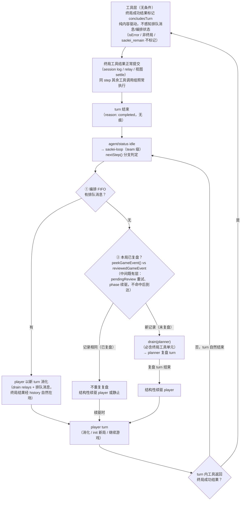

# Feature Specification: Agent v2 team 终局即时交接——终局工具结果自然收束 player 回合并触发复盘

**Feature Branch**: `062-team-game-end-handoff`

**Created**: 2026-09-12

**Status**: Draft

**Input**: User description: "1. 触发点前移：终局判定（胜利或失败）发生在**工具返回终局结果的时刻**，立即进行 player→planner 切换（团队协作机制），不依赖 player 自己停止。2. **不是 abort**：player 在游戏结束后不执行 next-step——turn 在终局工具结果之后**自然收束**；其他逻辑全部正常（tool result 正常进入 history）。3. **无痕性**：后续的 agent 执行（planner 复盘回合、之后切回的 player 回合）看不到任何 abort 标记或消息缺失——日志等价于模型在终局步自然停手（turn 结束、不再有新的模型调用）。4. **交接可见性**：切换到 planner 后，planner 能看到 player 最后这次工具调用的结果（经 relay/广播）；之后切换回 player，player 上下文中也能看到。"

## Motivation

059 建立的 gameEnded 复盘触发锚定在 **player turn 结束**：编排器 `nextStep()` case 4 在 player 回合 idle 后求值 `peekGameEvent()`（`common/js/dsh-plugins/saolei-loop/src/orchestrator.ts:796-805`；`specs/059-agent-v2-team-mode/data-model.md` §5 切换锚点"player 回合结束时的切换评估"）。该锚点的成立前提是 player 模型自行停手，而真实 LLM player 不满足此前提：saolei 工具指引明文引导终局后再开局（"A won/lost board is TERMINAL for cell operations … Call `saolei_init` to start a new game"，`common/js/dsh-plugins/saolei/src/index.ts:302`），用户自建 persona 进一步强化"充分使用你的工具来完成游戏"。结果：真实会话中 player 在**同一 turn 内**连续游戏，turn 不结束 → 复盘永不触发。生产实证（本对话观察，运行时数据不在仓库内）：会话 `templates/saolei/sessions/d4f677888cd38df8897f514eadb0c0fb` 中局 1 失败后 player 自行 re-init 局 2，planner 视角零 relay 注入。fake-llm 测试的 player 按脚本在局后停手（终局后输出总结文本收尾，`projects/game/testplan/agent_v2_game_test.go:78-80` 等处断言该文本），故大型测试全绿未暴露缺陷。

目标与现状的差距（本 feature 要完成的工作）：

| 维度 | 现状 | 目标 |
|---|---|---|
| 终局后的 player 回合走向 | 收束依赖模型自律停手；真实 LLM player 同 turn 连续调用工具开新局，turn 不结束 | **终局工具结果本身收束当前 turn**（dsh 工具层 turn 收束机制）：终局 step 之后不再有新的模型调用，player 无需也不可能在同 turn 继续操作 |
| planner 复盘触发时机 | 依赖 player turn idle——真实会话中该锚点永不到达，planner 零感知 | turn 在终局工具结果后即刻收束 → 既有 idle 锚点即刻到达 → **既有复盘评估原样接管**（编排器零改动） |
| 终局步的日志与呈现 | 无"终局即收束"路径；唯一提前终局手段是 cancel/abort——固化 abort 标记（interrupted assistant message、`turn/end{aborted}`、跳过调用的合成错误结果），已被用户明确否定 | turn/end 记录 `completed`（与自然停手同因）；无任何 abort 标记、无消息缺失；webUI turn_end 帧 = `TURN_STATUS_COMPLETED` |
| 大型测试暴露能力 | player 脚本在局后停手，缺陷不可见 | 大型测试以"终局后仍有后续脚本步骤"的 player 断言收束切面：后续步骤零执行、复盘即时发生 |

## Clarifications

> 本节记录已裁定/已验证事项的结论来源；终态规范编码于 FR 与 Assumptions。完整源码证据链（含行号）见同目录 [research-notes.md](research-notes.md)（草稿，供 /speckit research 流程引用）。

### 机制调研结论（源码级，2026-09-12，本地物化 0.1.1-rc.2）

- **dsh 工具层存在官方 turn 收束 seam，且同时满足"自然收束 + 无痕"**：工具体持有 `ToolRunContext`（`node_modules/.pnpm/@deepseek-ai+dsh-tools@0.1.1-rc.2_*/node_modules/@deepseek-ai/dsh-tools/lib/types/index.d.ts:283-300`），调用 `exec.concludeTurn()` 后，**成功**结果携带 `concludesTurn: true`（仅 `ToolExecutionSuccess` 可携带，`:388-399`）——经 agent-loop `runGroup.commitReady` 在 `tool/result` **正常提交之后**聚合为 `concluded`（`node_modules/.pnpm/@deepseek-ai+dsh-agent-loop@0.1.1-rc.2_*/node_modules/@deepseek-ai/dsh-agent-loop/lib/index.js:176-187`）→ `step()` 返回 `{kind:"completed"}`（`:685-686`）→ turn 以 `turn/end` reason `{kind:"completed"}` 收束（与纯文本自然停手同因，`:556-571,590-598`）。`concludesTurn` 是**执行局部信号，不落 durable 事件**（`tool/result` 事件只持久化 content/isError/error/meta，`:302-318`）——日志与自然停手不可区分。收束语义精确为"该 step 之后不再发起下一次模型调用"：同 step 内位于终局调用之后的其他工具调用组仍正常执行并提交（`executeToolCalls` 循环不因 concluded 中断，`:130-143`）。
- **终局通知通道无需新增机制**：runtime 在 `operate()` 内终局判定成立时同步写入 `this.gameEvent`（`common/js/dsh-plugins/saolei-loop/src/game/runtime.ts:277-285`），先于工具返回；turn 收束 → `agent/status` idle（既有事件）→ 编排器 `drive()` 的 idle 等待解除（`orchestrator.ts:820-852`）→ pump 重新求值。**idle 即通知**，且是"至多驱动一个成员"不变量下复盘的最早可能时刻——runtime→编排器的专用事件/回调不必要。
- **relay 完整性由既有机制保证**：终局 `tool/result` 提交进 player session log 后，team 服务经 `session/event` 监听即刻将完整工具单元（call+result 配对）relay 进 planner 待消费列表（`common/js/dsh-plugins/team/src/team.ts:315-360`）；`drain` 以 sender log 派生为读权威回读渲染（`:185-203,397-425`；单元完整性要求 call+result 配对，`common/js/dsh-plugins/team/src/broadcast.ts:121-155`）。
- **切换时序：既有 post-idle 评估原样接管，编排器零改动**：turn 收束 → idle → `nextStep()` case 4 的 `peekGameEvent()` 读到终局记录 → `drain(planner)` 必含终局工具单元（player 自上次 planner 驱动后的全部产出，含终局 step）→ 复盘驱动。排队消化优先序（case 1 排队 → pendingReview 重试 → case 4 gameEnded 评估 → 结构性续驱）全部保持。
- **后续上下文完整**：planner 复盘回合模型输入 = drain 注入的终局工具单元（`<player-tool-call>` 标签对内 args/result 全文，059 FR-008 / 060 contracts/team-api.md §4 既有语义）；复盘后结构性续驱的 player 回合，其模型输入经 `deriveMessages()` 读 session log，含 player 自己的终局 tool call+result（`lib/index.js:613`）。
- **cancel 路线对照（用户已否定，固化理由）**：dsh cancel 默认 durable 清空全部 pending、无 step-only abort（`specs/061-team-queue-steer/research.md` R5 取消语义）；abort 路径固化 interrupted assistant message（`interrupted: true`）、`turn/end{aborted, reason}`、未启动调用的合成错误结果 "Error: tool call aborted before dispatch"（`lib/index.js:629-649,574-580,273-290`）——与"无痕性"不可调和。

### 用户裁定（本 feature Input，2026-09-12）

- **触发点前移**：终局判定（胜利或失败）发生在工具返回终局结果的时刻，立即进行 player→planner 切换（团队协作机制），不依赖 player 自己停止。
- **不是 abort**：player 在游戏结束后不执行 next-step——turn 在终局工具结果之后自然收束；其他逻辑全部正常（tool result 正常进入 history）。
- **无痕性**：后续的 agent 执行（planner 复盘回合、之后切回的 player 回合）看不到任何 abort 标记或消息缺失——日志等价于模型在终局步自然停手（turn 结束、不再有新的模型调用）。
- **交接可见性**：切换到 planner 后，planner 能看到 player 最后这次工具调用的结果（经 relay/广播）；之后切换回 player，player 上下文中也能看到。

### Session 2026-09-12

- Q: 终局收束的判定范围——仅"本步致终局"的 operate，还是任何返回终局棋盘的工具结果？ → A: 任何返回终局棋盘（won/lost）的成功工具结果统一收束（含 init 即终局、对终局棋盘的结构性拒绝；`saolei_remain` 除外）；切换条件保持简单、无状态、纯结果内容驱动（工具层不感知编排/复盘状态）；同一局游戏不重复切换——复盘后 player 不开新局而操作旧终局棋盘属 LLM 行为问题、不属 team 协作语义，由既有 `reviewedGameEvent` 去重保证不重复复盘。
- Q: 游戏结束时有排队消息时，工具层收束标记与 turn 终止的关系？ → A: 工具层收束标记无条件：saolei 工具只要返回的游戏状态为终局就必定标记 `concludesTurn`，不因排队消息存在与否而变化（否则工具需耦合上层逻辑）；标记由 dsh-agent-loop 消费，工具层不可亦不应干预其消费语义。编排 FIFO 排队消息不进入 agent 侧 next-step inbox——终局流程照常 game end → step end → turn end，返回 saolei-loop 后在 idle 分支判定：队列空 → planner 复盘；队列非空 → player 以新 turn 消化（`orchestrator.ts:772-779` 既有 case 1：drain(player) relays + 排队消息；终局工具结果已经 history 自然在输入中），下次切换判定由后续终局工具结果正常驱动。

### 终局处理流程总览

三层收束语义的终态全景：工具层无条件标记（FR-001/FR-002，纯内容驱动）→ turn 无痕终止（dsh-agent-loop 消费 `concludesTurn`，FR-003）→ saolei-loop 在 idle 锚点分支判定（FR-004：①编排 FIFO 排队消息消化优先；②`reviewedGameEvent` 去重决定是否复盘）。分支判定与工具标记零耦合——任一分支都不回写、不抑制、不重标记工具层的收束标记。

## User Scenarios & Testing *(mandatory)*

### User Story 1 - 终局工具结果即时收束 player 回合并触发 planner 复盘 (Priority: P1) 🎯 MVP

player 回合在途、模型逐步调用 saolei 工具进行游戏。某次 `saolei_operate` 的执行在本步内终局（该次调用的识别棋盘为 won/lost，GameRuntime 写入终局记录）：工具结果正常返回并进入 player 历史/广播/视图；该 step 之后 player 的当前 turn 自然收束——不再发起下一次模型调用（即便提示词与 persona 都在鼓励继续、脚本里还有后续步骤）；turn 收束后编排层即刻按既有评估驱动 planner 复盘（复盘输入含终局工具单元）；复盘结束后结构性续驱 player 开新局，多局闭环照常运转。

**Why this priority**: 本 feature 的核心行为修正——修复生产实证的"复盘永不触发"缺陷。收束是切换的前提：turn 在终局结果处收束，既有 idle 锚点即刻到达，复盘即时发生。

**Independent Test**: 大型测试（fake-llm + fake-desktop）：player 脚本在终局后**仍备有后续步骤**（模拟真实 LLM 连续游戏倾向），断言：终局 `tool_result` 之后 player 无任何新的模型输出（后续脚本步骤零执行）；紧接 planner 复盘 turn（4-turn 链：planner 开局 → player 局 1 → planner 复盘 → player 局 2）；全程单流覆盖、无需用户追加输入。

**Acceptance Scenarios**:

1. **Given** player 回合在途且某次 operate 致终局（won/lost），**When** 该工具结果返回，**Then** 该结果正常进入 player 历史（tool/call+tool/result）与广播，此 turn 不再有任何 player 模型调用，turn 以 completed 收束。
2. **Given** 终局收束发生，**When** turn idle 到达，**Then** 编排层按既有优先级评估（排队消息消化 → pendingReview → gameEnded 复盘 → 结构性续驱），复盘驱动即刻发生，其输入含终局工具单元。
3. **Given** 复盘回合结束，**When** 结构性续驱 player，**Then** player 开新局（init 重新识别棋盘）照常运转，多局闭环不受影响。
4. **Given** 多操作批量中途终局，**When** 终局 op 生效，**Then** 既有结构性停批语义保持（终局 op 之后批量内不再执行），收束随本次调用的单一结果发生。

---

### User Story 2 - 无痕终态：收束与自然停手不可区分 (Priority: P1)

终局收束路径不产生任何 abort 痕迹：player session log 中终局 step 的形态为 assistant/message（含 tool-call）→ tool/call → tool/result → step/end → turn/end（reason `completed`）——与模型自然停手的差异仅为"不再有后续模型调用"这一用户已裁定的等价目标；无 interrupted 标记、无合成错误结果、无消息缺失。webUI 的 turn_end 帧呈现 `TURN_STATUS_COMPLETED`（与自然完成一致，非 CANCELED/ABORTED/ERROR）；取消（Cancel）与刷新（UpdateTeam）的既有终态语义零改动——用户主动取消仍走既有 abort 呈现，与本 feature 的收束路径互不干扰。

**Why this priority**: 用户裁定的核心约束（无痕性）；它把收束与 cancel/abort 路线从根本上区分开，是"团队协作机制而非干预"的语义基础，也是后续 agent 执行（复盘、再驱动）上下文干净的前提。

**Independent Test**: 大型测试断言终局 player turn 的 turn_end 帧 status = COMPLETED、该 turn 的最后输出块 = 终局工具结果、视图/历史无 interrupted/合成错误痕迹、List 回填与实时一致；Cancel 回归用例（既有）保持通过。

**Acceptance Scenarios**:

1. **Given** 终局收束发生，**When** 检查 player session log，**Then** turn/end reason 为 `{kind:"completed"}`，终局 step 无 interrupted 标记、无 "tool call aborted" 类合成结果，工具结果全文在场。
2. **Given** 终局收束发生，**When** webUI 消费 turn_end 帧，**Then** status 为 `TURN_STATUS_COMPLETED`，成员视图最后一块为终局工具调用块（结果已 settle）。
3. **Given** 用户在游戏进行中（非终局时刻）主动 Cancel，**When** 取消生效，**Then** 既有 abort 呈现保持（CANCELED 帧、终止态），本 feature 不改变取消语义。

---

### User Story 3 - 交接可见性：planner 复盘输入与 player 后续上下文完整 (Priority: P2)

切换到 planner 后，planner 复盘回合的模型输入包含 player 最后这次工具调用的完整结果：终局 step 的广播单元（assistant message 与 tool-call+result 配对单元）1:1 relay 给 planner（`<player-tool-call>` 标签对内 tool/args/result 全文，不截断）。之后切换回 player（复盘后的结构性续驱），player 上下文中也完整保留其终局 tool call+result（session log 完整性自然导出），新局决策建立在完整历史之上。

**Why this priority**: 用户裁定的交接要求；复用 059 FR-008 / 060 contracts/team-api.md §4 的既有 relay 语义，本 feature 的义务是保证终局步被该机制完整覆盖并作为验收断言固化。

**Independent Test**: 大型测试断言（planner 成员视图 + fake-llm review 规则 keywords 命中——终局 relay 即复盘驱动最后一条 user 消息）：复盘 turn 的输入含 `<player-tool-call>` 单元且 result 含终局 status 全文；复盘后 player turn 的输入含其自身终局 call+result（session log 完整性/回填断言）；player 视图含复盘 relay（既有断言回归）。

**Acceptance Scenarios**:

1. **Given** 终局收束并触发复盘，**When** planner 复盘回合的模型输入组装，**Then** 输入含终局工具单元（全文、发送者标注、无头行——060 §4 终态格式）。
2. **Given** 复盘结束、结构性续驱 player，**When** player 新回合的模型输入组装，**Then** 输入含 player 自己的终局 tool call+result 与 planner 复盘 relay。

---

### User Story 4 - 边界与联动保持 (Priority: P2)

收束仅由经 GameRuntime 支撑的 saolei 工具成功结果触发（无 runtime 的调用既有 fail-loud 报错边界保持，planner 误调 saolei 工具仍为模型可见错误而非收束）；同一 step 中终局调用之后的其他工具调用组仍正常执行并提交（dsh 调度语义）；终局步前排队的用户消息走既有消化路径（player 以新回合消化，消化优先于 gameEnded 评估——`common/js/dsh-plugins/saolei-loop/src/orchestrator.ts:772-779` 既有 case 1 优先序）；刷新/暂停/恢复语义零改动。

**Why this priority**: 锚定不变量，防止收束机制改变 team 编排的其他语义；这些边界多由既有机制自然导出，本 feature 显式声明为验收面。

**Independent Test**: 大型测试回归断言：既有 team 大型测试全量通过（含因移除"脚本停手"假设而更新的断言）；单测断言收束触发条件（终局成功结果收束、失败/非终局不收束、remain 不收束、无 runtime 报错不收束）。

**Acceptance Scenarios**:

1. **Given** 同一 step 中模型同时请求 saolei_operate（致终局）与其他工具，**When** 调度执行，**Then** 两组调用都正常执行并提交结果，之后 turn 收束（收束只作用于"不再发起下一次模型调用"）。
2. **Given** 终局步之前用户消息已入编排 FIFO，**When** 终局 turn 收束，**Then** 该消息由 player 以新回合消化（消化优先于 gameEnded 评估），消化完成后复盘/续驱按既有优先级进行。
3. **Given** planner 误调 saolei 工具（其 agent scope 无 saoleiGame 服务），**When** 调用执行，**Then** 既有 fail-loud 错误结果保持（不收束、不静默成功）。

---

### Edge Cases

- **终局步前用户消息已入编排 FIFO**：不影响工具层收束标记（无条件携带，FR-001）；FIFO 位于编排层、不进 agent 侧 next-step inbox，终局流程照常 game end → step end → turn end；saolei-loop 在 idle 分支按既有优先序消化（`orchestrator.ts:772-779` case 1：drain(player) relays + 排队消息驱动 player 新 turn，终局工具结果经 history 自然在输入中）；下次切换判定由后续终局工具结果正常驱动（消化 turn 中开新局且终局时复盘对象为新局——判定始终由工具结果内容驱动）。
- **终局调用的桌面派发失败**：结果为 isError（`dispatch-failed`）→ 不收束（`concludesTurn` 仅成功结果可携带），模型看到失败并按既有语义处置；后续真正的终局成功结果再收束。
- **取消与终局竞态**：终局工具执行中 Cancel 生效 → 信号中断路径接管（结果被替换为 ABORTED）→ 不收束、走既有 abort 呈现；终局结果已提交后 Cancel 无在途回合可终止（幂等）。
- **init 识别即终局的棋盘**（如 fake-desktop 固定胜利棋盘拓扑）：按 FR-002 在 init 结果处收束；终局记录不新增（init 不写 gameEvent，既有语义），无复盘，链路静止于 player 激活。
- **对终局棋盘的 operate 结构性拒绝**（`game_won`/`game_over` stop）：按 FR-002 同样收束；该拒绝不重写终局记录（runtime 仅在致终局 op 上写 gameEvent），若该记录已被复盘（`reviewedGameEvent` 相同）则不重复复盘，按既有评估续驱或静止——复盘后 player 不开新局而操作旧终局棋盘属 LLM 行为问题，不属 team 协作语义。
- **多局循环**：复盘后续驱的 player 新 turn 中 init 重新识别新棋盘（playing）→ 不收束，游戏正常进行；每局终局各自收束一次。
- **刷新（UpdateTeam）与终局并发**：既有作废语义不变（在途回合终止、清空重建）。

## Requirements *(mandatory)*

### Functional Requirements

**终局收束（核心）**

- **FR-001**: `saolei_operate` 的执行在本步内终局（GameRuntime 在该次调用内写入终局记录，`common/js/dsh-plugins/saolei-loop/src/game/runtime.ts` 既有 `endedStatus` 判定）时，该次工具执行 MUST 标记当前 agent turn 收束（dsh 工具层收束 seam：`ToolRunContext.concludeTurn()`，经工具**成功**结果携带 `concludesTurn`）：终局工具结果 MUST 正常提交（session log `tool/call`+`tool/result`、团队广播、视图 settle），此后该 turn MUST NOT 再发起下一次模型调用，turn MUST 以 `completed` 收束。收束标记 MUST 仅经成功结果携带——失败结果（isError）MUST NOT 收束。标记 MUST 无条件随终局成功结果携带：不因任何排队输入的存在与否而变化，工具层与上层排队状态零耦合；`concludesTurn` 由 dsh-agent-loop 消费，工具层不干预其消费语义。
- **FR-002**: 任何返回终局棋盘（won/lost）的成功 saolei 工具结果 MUST 统一收束 turn：① `saolei_init` 识别即终局的棋盘；② 对终局棋盘的 `saolei_operate` 结构性拒绝（`game_won`/`game_over` stop，正常结果形态）。收束判定 MUST 保持无状态、纯结果内容驱动——工具层 MUST NOT 感知编排/复盘/切换状态。`saolei_remain` MUST NOT 收束（只读查询，结果不含棋局状态）。同一局游戏 MUST NOT 重复触发复盘切换：对已复盘终局棋盘的操作（其结构性拒绝结果同样收束 turn，且该拒绝不重写终局记录——runtime 仅在致终局 op 上写 gameEvent）经既有 `reviewedGameEvent` 去重不重复复盘；复盘后 player 不开新局而操作旧终局棋盘属 LLM 行为范畴，不属 team 协作语义。

**无痕性与呈现**

- **FR-003**: 终局收束路径 MUST NOT 产生任何 abort 痕迹：turn/end reason MUST 为 `completed`；MUST NOT 出现 interrupted assistant message、未启动调用的合成错误结果；webUI turn_end 帧 status MUST 为 `TURN_STATUS_COMPLETED`。用户主动 Cancel 与刷新的既有终态语义（CANCELED/ABORTED 呈现）MUST 零改动。

**编排与交接**

- **FR-004**: 收束后的 player→planner 切换 MUST 完全经由既有 idle 锚点与 pump 评估接管（排队消化优先序、pendingReview 重试、gameEnded 复盘评估、结构性续驱全部保持）；编排层（`common/js/dsh-plugins/saolei-loop/src/orchestrator.ts`）MUST NOT 为本 feature 新增切换逻辑或合成驱动消息（059 FR-009/FR-010 保持）。收束与切换判定 MUST NOT 因排队输入做任何特判：终局 turn 照常收束，编排 FIFO 排队消息由既有 idle 分支按优先序消化（消化优先于 gameEnded 评估），后续切换由后续终局工具结果正常驱动——不抑制收束标记、不快照或排队终局记录、不在后续 step 重标记。
- **FR-005**: 终局 step 的广播单元（assistant message 与 tool-call+result 配对）MUST 完整 1:1 relay 给 planner（059 FR-008 既有语义覆盖终局步）；planner 复盘回合的模型输入 MUST 含该终局工具单元（tool/args/result 全文）；复盘后结构性续驱的 player 回合，其模型输入 MUST 含 player 自己的终局 tool call+result。

**作用边界**

- **FR-006**: turn 收束 MUST 仅由经 GameRuntime 支撑的 saolei 工具成功结果触发（无 runtime 的调用既有 fail-loud 错误边界保持）；同一 step 中位于终局调用之后的其他工具调用组 MUST 仍正常执行并提交（收束只作用于"不再发起下一次模型调用"）；多操作批量中途终局 MUST 保持既有结构性停批语义（终局 op 生效后停批、之前成功操作生效）。

### Key Entities

- **终局工具结果**：GameRuntime 在其执行内写入终局记录的那次（及按 FR-002 扩展的返回终局棋盘的）saolei 工具结果——收束的判定源，事实层面工具结果即终局（059 data-model.md §5 既有锚定的语义兑现）。
- **turn 收束（concludesTurn）**：dsh 工具层的成功结果标记：该 step 工具结果正常提交后，turn 不再发起下一次模型调用、以 `completed` 收束；执行局部信号，不落 durable 事件（与自然停手在日志上不可区分）。
- **终局记录（GameEventRecord）**：既有实体（runtime 持有 LATEST 终局记录，编排器经 `peekGameEvent()` 消费，复盘驱动 settle 后标记 reviewed）——本 feature 不改变其写入与消费语义。
- **切换锚点**：既有实体（turn 已结束且无待消化排队消息；idle 到达即求值）——本 feature 使其在终局时刻即刻到达，语义与优先级不变。

## Success Criteria *(mandatory)*

### Measurable Outcomes

- **SC-001**: 大型测试断言（fake-llm player 脚本终局后仍备有后续步骤）：终局 `tool_result` 之后 player 无任何新的模型输出（后续脚本步骤零执行）；紧接 planner 复盘 turn；复盘后结构性续驱 player 开新局；4-turn 链单流覆盖、除首条用户消息外无需用户输入。
- **SC-002**: 终态断言：终局 player turn 的 turn_end 帧 status = `TURN_STATUS_COMPLETED`；该 turn 最后输出块 = 终局工具调用块（结果已 settle）；session log/视图/List 回填无 interrupted、合成错误结果或消息缺失痕迹。
- **SC-003**: 交接断言：planner 复盘 turn 的模型输入含 `<player-tool-call>` 终局单元且 result 含终局 status 全文（断言面：planner 成员视图 + fake-llm review 规则的 keywords 命中——终局 relay 为复盘驱动最后一条 user 消息，命中即证明输入含该单元）；复盘后 player turn 的模型输入含其自身终局 tool call+result 与复盘 relay（session log 完整性/回填断言）。
- **SC-004**: 单测断言：runtime→工具的终局收束标记映射正确（致终局 operate / init 即终局棋盘 / 对终局棋盘的结构性拒绝 → 收束；失败/非终局 → 不收束；`saolei_remain` → 不收束；无 runtime 调用 → 既有报错、不收束）。
- **SC-005**: 回归：既有 team 大型测试（多局闭环、排队消化、取消、刷新重建、回填/断开收敛/多流去重）全量通过，含因移除"脚本停手"假设而更新的断言（终局总结文本不再存在——player turn 以终局工具结果收尾）。

## Assumptions

- **实现优先 dsh 原生能力**（用户裁定方向：自然收束、无痕）：收束经 dsh 官方 seam `ToolRunContext.concludeTurn()` / `ToolExecutionSuccess.concludesTurn` 实现；cancel 路线因 abort 标记被用户明确否定（dsh cancel 默认 durable 清空全部 pending、无 step-only abort，`specs/061-team-queue-steer/research.md` 既有记载）。
- **机制细节留给 plan**：runtime→工具层的收束标记载体（`ToolOutcome` 契约扩展，`common/js/dsh-plugins/saolei-loop/src/game/runtime.ts` 与 `common/js/dsh-plugins/saolei/src/index.ts` 之间的既有契约）、工具层映射位置、契约文档（051 contracts/saolei-plugins.md §3 一族）更新——不改变 FR 的终态行为。
- **单 agent 形态不存在于 agent_v2 生产**（源码核实：runtime 仅经编排器 player 挂载路径创建）：收束语义绑定"runtime 支撑的工具结果"而非 team 判定；无独立单 agent 消费面需要差异化。
- **提示词零改动**：saolei guidance 的终局表述（"A won/lost board is TERMINAL … Call `saolei_init` to start a new game"）跨 turn 仍然准确——终局 turn 内模型不再被调用，无从误用；复盘后续驱的新 turn 中该指引正确。
- **059 原文不改写**：其 Clarification/data-model §5 已将 gameEnded 事实锚定于"saolei 工具返回游戏终局结果（工具结果层面）"；本 feature 补足的是"turn 在该结果处收束"的机制，使既有锚点真正可达，非语义变更。
- **061 关系**：两 feature 无实现耦合、无语义冲突——本 feature 的收束标记与切换判定无状态、纯内容驱动，不因任何排队输入特判（FR-001/FR-004）；排队输入机制与终局边界的交互语义由 061 需求文档定义，本文不赘述。
- **测试基建联动**：fake-llm 夹具与大型测试断言随收束语义同批更新（constitution 原则 VI：大型测试全量通过作为验收）。
- **同 step 多工具调用组不新增断言面**：fake-llm 夹具单步仅支持单个 `tool_call`（`projects/game/fake-llm/service/message_types.go:108`），"同 step 中位于终局调用之后的其他工具调用组仍正常执行并提交"由 dsh-agent-loop 既有调度语义保证（`node_modules/.pnpm/@deepseek-ai+dsh-agent-loop@0.1.1-rc.2_*/node_modules/@deepseek-ai/dsh-agent-loop/lib/index.js:130-143`，组循环不因 `concluded` 中断）；本 feature 的边界验收面为批内停批（FR-006）与 isError 不收束。
