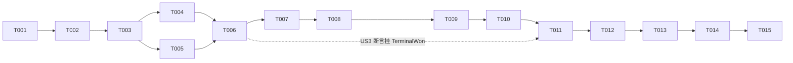

# Tasks: 062-team-game-end-handoff

**Input**: Design documents from `/specs/062-team-game-end-handoff/`

**Prerequisites**: plan.md（变更面与零改动面清单）、spec.md（FR-001~006 / SC-001~005 / User Stories）、research.md（D1~D7）、data-model.md（§1 判定矩阵）、contracts/saolei-turn-conclude.md、quickstart.md（V1~V5）

**Tests**: spec 显式要求（SC-004 单测断言、SC-001/002/003/005 大型测试断言）。单测按宪章原则 IV 内嵌于代码变更任务（不单列）；大型测试验收单列（原则 VI）。

**Organization**: 按 user story 分 phase（US1/US2 = P1，US3/US4 = P2）；生产代码全部收敛于 Foundational（四个 story 共用的同一机制）。

## Format: `[ID] [P?] [Story] Description`

- **[P]**: 可并行（不同文件、无未完成依赖）
- **[Story]**: 所属 user story
- 每任务含精确文件路径；bazel build+test 为代码任务的组成部分（AGENTS.md 命令入口）

---

## Phase 1: Setup（基线验证）

**目的**: 确认变更前基线为绿，建立可回归的起点。

**文档清单**：
- 代码规范文档：无
- 官方文档：无
- 技术文章/技术参考文档：`specs/062-team-game-end-handoff/plan.md`（Project Structure 一节——变更面/零改动面清单）

- - [X] T001 基线验证：`bazel test //common/js/dsh-plugins/saolei/... //common/js/dsh-plugins/saolei-loop/...` 全绿；`bazel build //projects/game/testplan:agent_v2_game_test //projects/game/testplan:agent_v2_game_disconnect_test //projects/game/fake-llm/service/...` 通过——记录基线结果供后续 phase 对照

---

## Phase 2: Foundational（收束机制——全部 story 的阻塞前置）

**目的**: 实现 `ToolOutcome` 契约扩展与工具层映射（FR-001/FR-002/FR-006 的生产代码面），附 SC-004 单测。

**⚠️ CRITICAL**: 未完成本 phase 前不得开始任何 user story phase。

**文档清单**：
- 代码规范文档：`style/javascript.md`；其引用基准 [Google TypeScript Style](https://google.github.io/styleguide/tsguide.html)
- 官方文档（dsh 物化源码，行号已在 research.md/contracts 核实；官方版本内容：[dsh-tools types（unpkg 0.1.1-rc.2）](https://unpkg.com/@deepseek-ai/dsh-tools@0.1.1-rc.2/lib/types/index.d.ts)、[dsh-agent-loop（unpkg 0.1.1-rc.2）](https://unpkg.com/@deepseek-ai/dsh-agent-loop@0.1.1-rc.2/lib/index.js)）：`node_modules/.pnpm/@deepseek-ai+dsh-tools@0.1.1-rc.2_*/node_modules/@deepseek-ai/dsh-tools/lib/types/index.d.ts`（`ToolRunContext.concludeTurn` :299、`ToolExecutionSuccess.concludesTurn` :388-399、`ToolExecutionFailure.concludesTurn?: never` :400-409）；`node_modules/.pnpm/@deepseek-ai+dsh-agent-loop@0.1.1-rc.2_*/node_modules/@deepseek-ai/dsh-agent-loop/lib/index.js`（executeToolCalls 组循环不因 concluded 中断 :130-143、commitReady 聚合 :176-187、durable 持久化字段 :302-318、turn/end reason :590-598、step 收束返回 :685-686）
- 技术文章/技术参考文档：`specs/062-team-game-end-handoff/data-model.md` §1（**判定矩阵——实现的直接依据**）、`specs/062-team-game-end-handoff/contracts/saolei-turn-conclude.md`（§1/§2 契约与映射代码形态）、`specs/051-agent-v2-dsh-migration/contracts/saolei-plugins.md`（基线契约：§2 `ToolOutcome`/`GameRuntime` 类型、§3 三工具 exec 映射——本 feature 同步其类型行为终态）、`specs/062-team-game-end-handoff/spec.md`（FR-001/FR-002/FR-006）、`specs/062-team-game-end-handoff/research.md`（D1/D2）、`specs/062-team-game-end-handoff/quickstart.md`（V1 单测断言面）

- [ ] T002 扩展 `ToolOutcome` 成功分支为 `{ isError: false; text: string; concludesTurn?: true }`（错误分支不变），在 `common/js/dsh-plugins/saolei-loop/src/game/runtime.ts` 以单一 helper（输入 state、`gameStatus(state) ∈ {won,lost}` 时返回 `{concludesTurn: true}`）应用于三个置位点：init 成功返回（:205）、operate 空操作列表返回（:224-227）、operate 正常返回（:287-290）；`remain` 与无棋盘路径不置位；同步更新 `common/js/dsh-plugins/saolei-loop/src/game/runtime.test.ts`——判定矩阵 runtime 侧 10 行逐行断言（致终局 operate/init 即终局/终局结构性拒绝/终局棋盘空操作列表 → 置位；playing/`no_active_game`/`unable to recognize board`/remain → 不携带；dispatch FAILED → isError 无标记；第 11 行工具层参数组合拒绝归 T003），既有终局棋盘用例的 `toEqual` 断言随可选字段同步；同步更新 `specs/051-agent-v2-dsh-migration/contracts/saolei-plugins.md` §2 类型行与 §3 映射声明为终态（引用 062 契约 `contracts/saolei-turn-conclude.md`）；`bazel test //common/js/dsh-plugins/saolei-loop/...` 全绿
- [ ] T003 在 `common/js/dsh-plugins/saolei/src/index.ts` 的 `executeOutcome`（:109-118）增加映射：`outcome.concludesTurn === true` 时先调用 `exec.concludeTurn()` 再返回 `{result: outcome.text}`（isError 抛错路径不变）；同步更新 `common/js/dsh-plugins/saolei/src/index.test.ts`——`fakeExec` 增加 `concludeTurn` spy，断言置位 outcome → 恰好调用一次、不置位/isError → 零调用、参数组合拒绝（判定矩阵第 11 行，不进 runtime）→ 零调用；`bazel test //common/js/dsh-plugins/saolei/...` 全绿（依赖 T002 的类型扩展）

**Checkpoint**: 收束机制就绪（SC-004 全绿）——user story phase 可开始。

---

## Phase 3: User Story 1 - 终局工具结果即时收束 player 回合并触发 planner 复盘 (Priority: P1) 🎯 MVP

**Goal**: 大型测试主线上暴露收束切面：终局 `tool_result` 后 player 无任何新模型输出（fake-llm 既有终局链步骤零执行）、紧接 planner 复盘、4-turn 链单流覆盖（SC-001 主线）。

**Independent Test**: `bazel build //projects/game/testplan:agent_v2_game_test` 通过；实际执行归 T015（Phase 7 验收的 game-system suite），期望 `TestAgentV2TeamGameTerminalWonAndReviewContinues` 与 `TestAgentV2TeamGameTerminalLostAndReviewStops` 通过：game 1 turn 以终局 tool_result 收尾（无总结文本）、4-turn 链形状保持、game 2 init 即终局后 turn 收束（1 个 tool_result）。

**文档清单**：
- 代码规范文档：`style/golang.md`（单元测试规范节——大型测试代码必须遵守）；其引用基准 [Google Go Style](https://google.github.io/styleguide/go/)（入口索引）与 [Style Guide](https://google.github.io/styleguide/go/guide)（规范+权威，必读）、`style/large_test.md`（测试组织：按模块归位，勿按 spec 编号建文件）
- 官方文档：无（fake-llm/guitar 均为仓库自有组件）
- 技术文章/技术参考文档：`specs/062-team-game-end-handoff/spec.md`（US1 Acceptance Scenarios、SC-001）、`specs/062-team-game-end-handoff/research.md` D6（测试基建策略——"已脚本化不执行"断言面）、`specs/062-team-game-end-handoff/quickstart.md` V2、`projects/game/fake-llm/service/testdata/team_planner.yaml`（review 条目锚定 `history_keywords` 工具结果原文——**零改动**，确认即可）

- [ ] T004 [US1] 更新 fake-llm 夹具注释（规则本体保留原样——它们是"终局后仍备有的后续脚本步骤"零执行断言面）：`projects/game/fake-llm/service/testdata/agent_v2_saolei_tools.yaml` 头部与 `agent-v2-saolei-operate-won`/`agent-v2-saolei-operate-lost`/`agent-v2-saolei-init-lost`/`agent-v2-saolei-init-operate` 各规则注释改为说明其新角色（终局收束路径下永不匹配请求）；`projects/game/fake-llm/service/testdata/team_player.yaml` 头部行为脚本注释同步（终局总结文本不再产生）；`bazel test //projects/game/fake-llm/service/...` 全绿（message_store 索引 lockstep 不受注释影响）
- [ ] T005 [US1] 更新 `projects/game/testplan/agent_v2_helpers_test.go` 常量区：移除 `agentV2WonSummaryText`/`agentV2LostSummaryText` 两个常量及其全部引用（终局断言锚点统一为工具结果文本："game status: won/lost"；退役说明随 T004 落于 fake-llm 夹具注释）
- [ ] T006 [US1] 更新 `projects/game/testplan/agent_v2_game_test.go` 的 `TestAgentV2TeamGameTerminalWonAndReviewContinues`：game 1 断言改为——turn 以 operate 终局 tool_result 为最后输出块（`teamTurnBlocks` 无收尾文本断言/最后块为工具块）、`turn_end` COMPLETED；game 2（init 即识别胜利棋盘）断言 tool_result 数 = 1 且后续脚本步骤（operate 批）零执行；4-turn 链形状与 relay/view 断言保持；`bazel build //projects/game/testplan:agent_v2_game_test` 通过（依赖 T004/T005）
- [ ] T007 [US1] 更新 `projects/game/testplan/agent_v2_game_test.go` 的 `TestAgentV2TeamGameTerminalLostAndReviewStops`：game turn 以 operate 失败终局 tool_result 收尾（无 lost 总结文本）、turn_end COMPLETED；复盘 turn 与停止确认 turn（零工具调用）断言保持；`bazel build //projects/game/testplan:agent_v2_game_test` 通过（与 T006 同文件，串行）

**Checkpoint**: US1 主线（SC-001 won/lost 两链）可独立验证。

---

## Phase 4: User Story 2 - 无痕终态：收束与自然停手不可区分 (Priority: P1)

**Goal**: SC-002 断言面：turn_end 帧 COMPLETED、终局 turn 最后输出块 = 已 settle 的终局工具块、历史/回填无 interrupted/合成错误痕迹；init 即终局的纯收束拓扑（WonChain）与无总结文本的 quiescence 轮询。

**Independent Test**: 实际执行归 T015（game-system suite）——`TestAgentV2TeamGameWonChainOnExecutor` 新形态通过：init 即胜利棋盘 → turn 在 init 后收束（1 个 tool_result、无第二次模型输出、turn_end COMPLETED）、无复盘（init 不写终局记录）链路静止、List 回填 1 个已 settle 工具块、无 interrupted 痕迹；Cancel 回归段保持 CANCELED。

**文档清单**：
- 代码规范文档：`style/golang.md`（单元测试规范节）；其引用基准 [Google Go Style](https://google.github.io/styleguide/go/)（入口索引）与 [Style Guide](https://google.github.io/styleguide/go/guide)（规范+权威，必读）、`style/large_test.md`
- 官方文档：无
- 技术文章/技术参考文档：`specs/062-team-game-end-handoff/spec.md`（US2 Acceptance Scenarios、SC-002）、`specs/062-team-game-end-handoff/data-model.md` §3（turn 终态三行可观测契约——断言依据）、`specs/062-team-game-end-handoff/quickstart.md` V3、`projects/game/agent_v2/src/history.ts`（只读参照：`MemberCollector.onStatus` 的 COMPLETED 导出与 `pendingOutcome` 仅 Cancel/刷新标记，:574-575/:764-805——零改动面）

- [ ] T008 [US2] 重塑 `projects/game/testplan/agent_v2_game_test.go` 的 `TestAgentV2TeamGameWonChainOnExecutor`：init 即识别胜利棋盘（FR-002 ①）→ player turn 在 init 后收束：tool_result 数 2 → 1（operate 断言移除，改为"无第二次模型输出"——脚本 `agent-v2-saolei-init-operate` 已备有 operate 批步骤而零执行）；turn_end 保持 COMPLETED 断言；终局记录不新增 → 无复盘、链路静止（不出现 planner turn）；回填断言 tool block 数 2 → 1 且结果与流文本一致；`bazel build //projects/game/testplan:agent_v2_game_test` 通过（依赖 T005 常量更新）
- [ ] T009 [US2] 更新 `projects/game/testplan/agent_v2_game_test.go` 的 `TestAgentV2TeamGameConversationStreamIndependentOfFlow`：quiescence 轮询锚点从 `agentV2WonSummaryText` 改为终局工具结果文本（player entry 含 "game status: won"）；其余断言保持；`bazel build` 通过（与 T008 同文件，串行）
- [ ] T010 [US2] 在 `projects/game/testplan/agent_v2_game_test.go` 三个终局用例（TerminalWon/TerminalLost/WonChain）统一补无痕断言：终局 player turn 最后输出块为已 settle 的工具调用块（无后续文本块）；List 回填与成员视图无 `interrupted` 标记、无 "tool call aborted" 类合成结果文本（可加共享 helper 断言单一概念，遵守 style/golang.md 测试规范）；`bazel build //projects/game/testplan:agent_v2_game_test` 通过（与 T008/T009 同文件，串行）

**Checkpoint**: US1+US2（两个 P1）均可独立验证。

---

## Phase 5: User Story 3 - 交接可见性：planner 复盘输入与 player 后续上下文完整 (Priority: P2)

**Goal**: SC-003 断言面：planner 复盘输入含 `<player-tool-call>` 终局单元（result 含终局 status 全文）；复盘后 player turn 输入含其自身终局 call+result 与复盘 relay。生产代码零改动（既有 relay 机制），本 phase 为断言固化。

**Independent Test**: 实际执行归 T015（game-system suite）——`TestAgentV2TeamGameTerminalWonAndReviewContinues` 的 relay 断言块在新 turn 形态下通过：planner 视图含 sender=player 的 `<player-tool-call>` 单元（标签对开头、无头行、result 含 "game status: won" 全文）；player 视图含复盘 relay。

**文档清单**：
- 代码规范文档：`style/golang.md`（单元测试规范节）；其引用基准 [Google Go Style](https://google.github.io/styleguide/go/)（入口索引）与 [Style Guide](https://google.github.io/styleguide/go/guide)（规范+权威，必读）、`style/large_test.md`
- 官方文档：无
- 技术文章/技术参考文档：[specs/060-agent-v2-team-optimize/contracts/team-api.md §4 广播 wire 格式](../060-agent-v2-team-optimize/contracts/team-api.md)（`<{role}-tool-call>` 标签对内 tool/args/result 全文、无头行——relay 断言的契约依据）、`specs/062-team-game-end-handoff/spec.md`（US3、SC-003、FR-005）、`specs/062-team-game-end-handoff/quickstart.md` V4

- [ ] T011 [US3] 校验并强化 `projects/game/testplan/agent_v2_game_test.go` 中 `TestAgentV2TeamGameTerminalWonAndReviewContinues` 的交接断言（收束后终局工具单元即 player turn 最后产出，relay 目标条目随之变化）：planner 视图 relay 断言确保命中**终局**工具单元（result 含 "game status: won" 全文、`<player-tool-call>\n` 前缀、无头行、不截断），并以 fake-llm review 规则 `history_keywords`（"game status: won"）命中佐证 planner 模型输入含该单元；复盘后 player turn 的上下文断言：其自身终局 tool call+result 在场（session log 完整性/回填）且复盘 relay 之后驱动新局；若 view 断言无法区分终局单元与前序单元则收紧匹配条件；`bazel build //projects/game/testplan:agent_v2_game_test` 通过（依赖 T006）

**Checkpoint**: US1+US2+US3 均可独立验证。

---

## Phase 6: User Story 4 - 边界与联动保持 (Priority: P2)

**Goal**: SC-005 断言面：多局闭环（init-terminal 拓扑下的 active_member 不变量）、FIFO 排队消化优先序、取消/刷新/disconnect/nodesktop 零回归（isError 不收束的天然回归面）。

**Independent Test**: 实际执行归 T015（game-system + game-disconnect suites）——`TestAgentV2TeamGameActiveMemberTransitions` 在 game 2 init 即终局拓扑下通过（flow 脚本消耗 init×2 + step×1 不变、末尾 active_member = player、cancel 段 CANCELED 不变）；`TestAgentV2TeamGameMultiSessionIsolation`/`DesktopAbsent` 及 disconnect/conversation/preset 套件零改动通过。

**文档清单**：
- 代码规范文档：`style/golang.md`（单元测试规范节）；其引用基准 [Google Go Style](https://google.github.io/styleguide/go/)（入口索引）与 [Style Guide](https://google.github.io/styleguide/go/guide)（规范+权威，必读）、`style/large_test.md`
- 官方文档：无
- 技术文章/技术参考文档：`specs/062-team-game-end-handoff/spec.md`（US4 Acceptance Scenarios、Edge Cases、SC-005）、`specs/062-team-game-end-handoff/quickstart.md` V5、`specs/062-team-game-end-handoff/research.md` D6（不受影响用例清单与拓态变化清单）

- [ ] T012 [US4] 更新 `projects/game/testplan/agent_v2_game_test.go` 的 `TestAgentV2TeamGameActiveMemberTransitions`：game 2 为 init 即终局拓扑——断言随收束调整（game 2 turn 仅 1 个 tool_result、无 operate 派发）；flow 脚本消耗序（initBoards×2 + stepBoards×1）与逐派发 active_member = "player" 检查保持；4-turn 链与末尾 active_member = "player"（结构性续驱 activation）保持；cancel 段（CANCELED 帧 + activation 不变）**零改动**；`bazel build //projects/game/testplan:agent_v2_game_test` 通过（依赖 T008 的拓态先例）
- [ ] T013 [P] [US4] 回归核对（预期零改动，逐项确认后记录；同 step 多工具组不新增断言——由 dsh 原生调度保证，见 spec.md Assumptions）：`projects/game/testplan/agent_v2_game_test.go` 的 `TestAgentV2TeamGameDesktopAbsent`（init dispatch FAILED = isError 不收束 → nodesktop 总结文本保持）与 `TestAgentV2TeamGameMultiSessionIsolation`（connected 会话 init 即胜利棋盘 → 1 个 SUCCEEDED init 结果断言兼容）、`projects/game/testplan/agent_v2_game_disconnect_test.go`、`projects/game/testplan/agent_v2_conversation_test.go`、`projects/game/testplan/agent_v2_preset_test.go`（nodesktop 语义均不受影响）；`projects/game/fake-llm/service/message_store_test.go` lockstep 不受注释变更影响——`bazel build //projects/game/testplan:agent_v2_game_test //projects/game/testplan:agent_v2_game_disconnect_test //projects/game/testplan:agent_v2_conversation_test //projects/game/testplan:agent_v2_preset_test` 通过

**Checkpoint**: 全部 user story 完成，进入验收。

---

## Phase 7: Polish & 验收（跨 story）

**目的**: 格式化收口、宪章原则 VI 大型测试全量验收。

**文档清单**：
- 代码规范文档：`style/golang.md`；其引用基准 [Google Go Style](https://google.github.io/styleguide/go/)（入口索引）与 [Style Guide](https://google.github.io/styleguide/go/guide)（规范+权威，必读）、`style/large_test.md`
- 官方文档：无
- 技术文章/技术参考文档：`.opencode/skills/testplan/SKILL.md`（guitar 执行流程与强约束）、`projects/game/testplan/system_test.yaml`（实际计划：3 suites/cases 的权威定义）、`tools/test/guitar/README.md`、`projects/game/testplan/README.md`（suite/case 组织）、`specs/062-team-game-end-handoff/quickstart.md`（全文——V1~V5 验收 walkthrough）、`.opencode/skills/signoz/SKILL.md`（仅失败排障路径——SKILL 指引的 logs/traces 查询）

- [ ] T014 格式化与构建收口：`bazel run //:go -- fmt [变更的 Go 文件]`；确认无 BUILD.bazel 变更需求（无新文件/target；如有则 `bazel run //:gazelle <目录>` 后核对）；`bazel build //common/js/dsh-plugins/saolei/... //common/js/dsh-plugins/saolei-loop/... //projects/game/testplan/... //projects/game/fake-llm/service/...` 与对应 `bazel test`（JS 包）全绿
- [ ] T015 大型测试全量验收（宪章原则 VI，经 testplan skill 执行，**全部用例通过**为标准）：`guitar run projects/game/testplan/system_test.yaml`（全量 3 suites：game-system [testplan/memory/web/conversation/preset/game/desktop_flow 全部 case] / game-disconnect / game-memory-down；如需聚焦可加 `--suite`，验收以全量全绿为准）；失败则定位修复后重跑直至全绿；按 SKILL 输出要求汇报（计划路径/校验/部署/每 case 结果/清理；失败时配合 signoz skill 查询定位）

---

## Dependencies & Execution Order

### Phase Dependencies

- **Phase 1（Setup）**: 无依赖，立即开始
- **Phase 2（Foundational）**: 依赖 Phase 1——**阻塞全部 user story**
- **Phase 3/4/5/6（US1→US2→US3→US4）**: 均依赖 Phase 2；因共享 `agent_v2_game_test.go` 同文件串行编辑，**按优先级顺序执行**（P1 → P1 → P2 → P2）
- **Phase 7（Polish/验收）**: 依赖全部 story phase 完成

### User Story Dependencies

- **US1（P1）**: 依赖 Phase 2（T002/T003）与 T004/T005（夹具/常量先行）
- **US2（P1）**: 依赖 Phase 2 + T005（常量）；T008 依赖 T006 先例语义上无硬依赖但同文件串行
- **US3（P2）**: 依赖 T006（其断言挂在 TerminalWon 用例上）
- **US4（P2）**: 依赖 T008（init-terminal 拓态先例）

### Task Dependencies（关键链）

### Parallel Opportunities

- T004（fake-llm testdata）与 T005（helpers 常量）：不同文件，可并行
- T013（回归核对）与 T012 同 phase 但前者以核对为主——若并行需注意同文件只读/只写分工（T013 不改 `agent_v2_game_test.go` 中 ActiveMemberTransitions 所属区域时可并行）
- `agent_v2_game_test.go` 内的各测试函数更新（T006-T012）因同文件**串行**执行，避免编辑冲突

---

## Implementation Strategy

### MVP First（Phase 1-3）

1. Phase 1 基线绿 → Phase 2 机制+单测绿（SC-004）
2. Phase 3 US1 主线大型测试更新（SC-001 won/lost 链）
3. **STOP and VALIDATE**: 经 T015 的 game-system suite 验收验证 US1 独立成立——生产缺陷（真实 LLM 连续游戏、复盘永不触发）即在此面被修复证明

### Incremental Delivery

1. Foundational → 机制可用（单测证明）
2. +US1 → 主线验收（MVP）
3. +US2 → 无痕面固化 → +US3 → 交接面固化 → +US4 → 边界/回归面固化
4. Phase 7 全量 guitar 验收（原则 VI：全部用例通过）

---

## Notes

- 生产代码仅两文件（`runtime.ts`/`index.ts`），编排器/team/relay/webUI 为零改动面（plan.md Project Structure 显式清单）——**禁止**在本 feature 中触碰
- fake-llm 终局链规则本体保留（零执行断言面），仅注释更新——**不要删除**这些规则
- `team_planner.yaml` 零改动（review 锚定 history_keywords 工具结果原文）
- 大型测试验收禁止以 `bazel build` 替代 `guitar run` 实际执行（宪章原则 VI）
