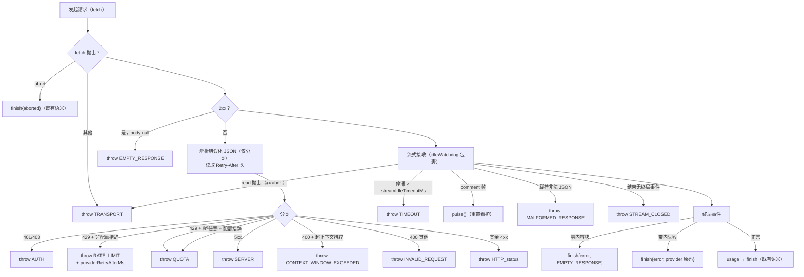

# Contract: LLM 失败分类、重试与可观测（llm-glm / llm-opencode-go 共用义务）

**Feature**: [spec.md](../spec.md) FR-001..008, FR-012, FR-016 | **决策**: [research.md](../research.md) D1-D7, D10

**适用对象**: `common/js/dsh-plugins/llm-glm/`、`common/js/dsh-plugins/llm-opencode-go/`（两适配器同套义务）

**参考先例**: 官方 deepseek 适配器（本地物化 `node_modules/.pnpm/@deepseek-ai+dsh-llm-deepseek@0.1.1-rc.2_*/lib/index.js`）；dsh cookbook [adding-an-llm-adapter](https://github.com/deepseek-ai/deepseek-harness/blob/master/docs/cookbook/adding-an-llm-adapter.md)

## 1. 失败码映射（adapter 义务）

失败码采用 dsh 共享分类学（完整映射表见 [data-model.md §1](../data-model.md)）。两适配器实现下列同一张状态判定表：



义务细则：

1. **错误体零回显**：非 2xx 响应体仅用于 `isQuotaExceededError` / `isContextWindowExceededError` 分类（`@deepseek-ai/dsh-llm` 导出）与 `cause` 链；`LlmError.message` 为稳定文本 + 状态码（如 `GLM endpoint returned HTTP 429`），不含响应体文本（token 零泄漏，`specs/049-agent-v2-dsh-init/contracts/glm-llm-plugin.md` §3 义务 6 同源约束）。
2. **Retry-After**：`Retry-After` 头（秒数或 HTTP 日期）解析为 `providerRetryAfterMs` 附于 `LlmError` options；头部值不视为敏感。
3. **空补全**：终局事件（Responses `response.completed`/`incomplete`；chat `[DONE]`）到达但零内容块 → `finish{kind:"error", failure:{code:"EMPTY_RESPONSE"}}`；有块则维持既有 finish 语义。
4. **看护**：`@deepseek-ai/dsh-timeout` `idleWatchdog` 包裹 fetch + 全部 body 读取迭代；SSE comment 帧经 wire 的 `onComment` 回调触发 pulse；超时 → `LlmError(..., "TIMEOUT")`。
5. **传输清理**：独立 `AbortController` 贯穿请求生命周期；生成器 `finally` 中 `abort()` + `reader.cancel()` + `releaseLock()`（消费方 `return()`/异常/正常耗尽均覆盖）。
6. **abort 语义不变**：caller abort → 终局 `finish{kind:"aborted"}`（既有）。

## 2. 重试策略声明（providerRetryPolicy）

```ts
override providerRetryPolicy(_provider: string): ResolvedRetryPolicy {
  return resolveRetryPolicy(this.config.retryPolicy, "<plugin>: retryPolicy");
}
```

- Config 增加可选 `retryPolicy`（dsh `RetryPolicySchema`：normal/always、maxRetries、retryableCodes、backoff）。
- 未配置 → dsh 默认：normal、5 次、`[EMPTY_RESPONSE, RATE_LIMIT, SERVER, TIMEOUT, TRANSPORT]`、500ms→10s、抖动 0.1。
- 重试执行由组合中既有 `llm-retry` 插件承担（`projects/game/agent_v2/cordis.yml:40`）；重试的 durable 事件 `llm/retry`/`llm/retry-started` 由其产出，适配器不感知。
- 配置变化经 cordis 行刷新（本仓库 env 注入模式：进程内静态，重启生效）。

## 3. 可观测（FR-012）

- **结构化失败日志**：编排器层产出（见 [orchestrator-turn-outcome.md §3](orchestrator-turn-outcome.md)），字段 `{session, phase, member, code, error}`；适配器不重复落日志。
- **重试可见**：`llm/retry` durable session 事件（llm-retry 既有），不入用户消息流（SC-001 "无重试痕迹泄漏"）。
- **token 零出现**：用户可见面 MUST 不含凭据值——`LlmError.message`、结构化失败日志正文（字段 `{session, phase, member, code, error}`，见上一条）与用户消息流/错误呈现；端到端判据以 `specs/063-llm-reliability-opencode-go/spec.md` SC-003 的「全部消息、错误与日志 token 零出现」断言兜底。原始错误体仅存在于 `cause` 诊断链（§1 义务 1、§4 义务 2），不上报日志正文、不进入 message：即使中间代理在错误体中反射了请求头，可见面仍零泄漏。

## 4. 测试义务（vitest，随包交付）

1. **码映射**：上表每个判定分支至少一条用例（注入 fetchImpl/Response 构造），断言 `LlmError.code` 与 `providerRetryAfterMs`。
2. **错误体分类不回显**：配额措辞体 → `QUOTA`，且 `error.message` 不含体文本；`cause` 含原始体。
3. **看护**：fake timers 推进 `streamIdleTimeoutMs` 无 read 完成 → `TIMEOUT`；comment 帧 pulse 重置窗口；窗口内正常长间隔不触发。
4. **空补全**：终局零块 → `finish{error, EMPTY_RESPONSE}`；带块正常。
5. **传输清理**：消费方提前 `return()` 后 fetchImpl 的 signal 进入 aborted、body cancel 被调用。
6. **providerRetryPolicy**：Config 透传解析；未配置回退默认。
7. **回归**：既有 `usage`→`finish` 序、abort finish、`attributionHeaders` 存在性用例保持通过（码断言从 `GLM_*` 迁移到新码）。
