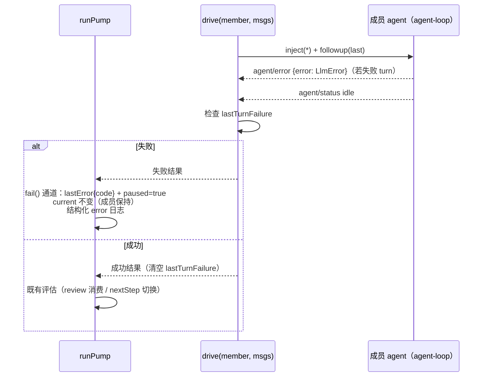

# Contract: 编排器 turn 结果观察与成员保持

**Feature**: [spec.md](../spec.md) FR-009..012 | **决策**: [research.md](../research.md) D8-D10

**位置**: `common/js/dsh-plugins/saolei-loop/src/orchestrator.ts`（`projects/game/agent_v2` 宿主消费）

**事件依据**: dsh-agent-loop `agent/error`（payload `{turn, step, error}`，失败 turn 的活跃边界、先于 idle，`node_modules/.pnpm/@deepseek-ai+dsh-agent-loop@0.1.1-rc.2_*/lib/index.js:465-473`）；编排器既有成员 ctx 订阅先例（`orchestrator.ts:614-618` `agent/status`）。

## 1. 观察 seam

`createMember` 在既有 `agent/status` 订阅旁增加：

```ts
runtime.offError = handle.agent.ctx.on("agent/error", (payload) => {
  // 成员 ctx 自身 dispatch，天然 agent-scoped；只在失败 turn 的活跃边界到达（先于 idle）
  runtime.lastTurnFailure = {
    code: payload.error instanceof LlmError ? payload.error.code : "UNKNOWN",
    message: payload.error instanceof Error ? payload.error.message : String(payload.error),
  };
});
```

- 订阅只**写标记**，不直接驱动状态转移——转移统一由 `runPump` 在 `drive()` 返回后评估（"至多驱动一个成员"不变量的单一执行点保持）。
- llm-retry 吸收的重试不产生 `agent/error`（waterfall 未决不 throw）→ 标记只在**最终失败**时写入。
- abort/取消不产生 `agent/error` → 取消路径零改动（spec US2 场景 6）。

## 2. drive() 结果语义与保持



- `drive()` 返回值（或等价结果通道）携带成败；失败时 `runPump` 走既有 `fail()` 通道（`orchestrator.ts:729-742`）：`lastError`（扩展 `code` 字段，[data-model.md §4](../data-model.md)）+ `paused = true` + 日志；**`this.current` 不变** → 激活成员保持（FR-009）。
- 下一次 `submit()` 既有逻辑解除 pause 并重驱 `current`（同成员重驱动，FR-010/US2 场景 2）。
- `pendingReview` 驱动失败：`pendingReview` 不消费（成功 settle 才清除，既有 `orchestrator.ts:710-714` 语义），复盘触发记录不丢失（spec Edge）。
- 排队消息：pause 期间队列保留，重驱时由保持成员按既有 FIFO 消化（FR-010）。
- 成员 turn 成功（`lastTurnFailure == null`）：清空标记，既有切换评估照常（`nextStep()` 的 `planning/reviewing → playing` 仅在此路径到达——FR-011 的可观察结果）。

## 3. 结构化失败日志（FR-012）

- 落点：编排器 `deps.logger`（宿主注入；`TeamSessions` 物化时传入服务 logger，使日志进 OTel 应用日志通道——生产实证通道存在，SigNoz `game/agent-v2`）。
- 级别 error；字段：`{session, phase, member, code, error}`（`error` 为错误文本，既有 `OrchestrationFailureContext` 键）；`code` 为 [data-model.md §1](../data-model.md) 稳定失败码（非 `LlmError` 时 `UNKNOWN`）。
- 约束：不含任何凭据值（适配器 message 零回显契约传递保证）；每失败 turn 恰一条（SC-004b）。

## 4. 快照与呈现

- `OrchestratorSnapshot.lastError` 增加 `code`；`failed`/`paused` 字段语义不变（既有 fail 通道）。
- `GetTeam` 的 `activeMember`/activation 呈现链零改动（保持的 `current` 自然呈现为激活成员——SC-002 的断言面）。
- web UI 对失败保持状态的呈现 = 既有 error 帧 + turn_end ERROR（零新增 UI 状态，spec Assumption）。

## 5. 测试义务

1. **harness 扩展**（`orchestrator.test.ts` fake member）：新增 `failCurrentTurn(code)`——emit `agent/error`（payload 带 `LlmError` 形态 error）后 emit idle，模拟失败 turn 收束。
2. **保持语义**：planning 阶段 planner 失败 turn → `snapshot()` 断言 `activation === "planner"`、`paused === true`、`lastError.code`；再次 submit → planner 重驱（followups 断言）且不切 player。
3. **成功路径回归**：既有"planner settle → 切 player"用例保持通过（`orchestrator.test.ts:411-418` 语义不变）。
4. **取消例外**：`cancel()` 路径不产生保持（无 agent/error → 无标记）。
5. **review 失败**：pendingReview 驱动失败 → 记录保留、重驱复盘（既有用例扩展 code 断言）。
6. **日志断言**：fail 通道 logger error 恰一条、字段完整、`error` 文本无 token。
