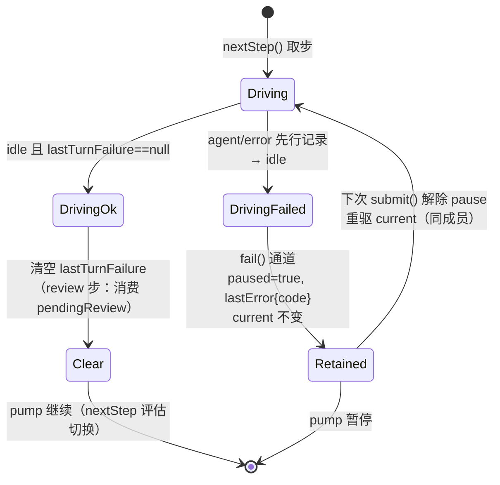

# Data Model: LLM 请求发送可靠性修复与 opencode-go 模型接入

**Feature**: [spec.md](spec.md) | **决策**: [research.md](research.md) | **契约**: [contracts/](contracts/)

## 1. 稳定失败码（llm-glm 与 llm-opencode-go 共用分类）

LLM 请求失败的机器可路由分类。重试决策（llm-retry）与结构化日志（FR-012）共同消费；对齐 dsh 共享分类学（`node_modules/.pnpm/@deepseek-ai+dsh-llm@0.1.1-rc.2_*/node_modules/@deepseek-ai/dsh-llm/lib/index.js:230-320`）。

| 码 | 触发条件 | 可重试（默认策略） | 来源层 |
|---|---|---|---|
| `TRANSPORT` | fetch/流读取抛出（非 abort） | ✅ | adapter throw |
| `TIMEOUT` | 流停滞超过 `streamIdleTimeoutMs`（看护触发） | ✅ | adapter throw |
| `RATE_LIMIT` | HTTP 429（错误体非配额措辞） | ✅（尊重 `Retry-After`） | adapter throw |
| `SERVER` | HTTP 5xx | ✅ | adapter throw |
| `EMPTY_RESPONSE` | 响应无 body；或终局事件零内容块 | ✅ | adapter throw / 带内 finish |
| `AUTH` | HTTP 401/403 | ❌ | adapter throw |
| `QUOTA` | 任意状态 + 错误体配额措辞（`isQuotaExceededError`） | ❌ | adapter throw |
| `CONTEXT_WINDOW_EXCEEDED` | HTTP 400 + 错误体超上下文措辞（`isContextWindowExceededError`） | ❌ | adapter throw |
| `INVALID_REQUEST` | HTTP 400（其余）；序列化不支持的内容（原 `UNSUPPORTED_CONTENT` 语义并入 INVALID_REQUEST 类不可重试域，保留原码 `UNSUPPORTED_CONTENT`/`UNSUPPORTED`） | ❌ | adapter throw |
| `HTTP_<status>` | 其余 4xx | ❌ | adapter throw |
| `STREAM_CLOSED` | 流结束无终局事件 | ❌（对齐官方默认） | adapter throw |
| `MALFORMED_RESPONSE` | SSE 载荷非法 JSON | ❌ | adapter throw |
| provider 原码 | 带内失败（Responses `response.failed`/`error`；chat `finish_reason` 异常值映射 `CONTENT_FILTER` 类） | 按码匹配（默认不命中） | 带内 finish |

## 2. GlmConfig / OpencodeGoConfig（插件配置）

两插件同构（差异仅默认值与目录）：

```ts
interface LlmPluginConfig {
  /** token 环境变量名（宿主注入；空值 → 请求不携带 Authorization）。 */
  apiKeyEnv: string;
  /** 端点基址（含版本路径）。 */
  baseURL: string;
  /** 静态模型目录（id + 上下文窗口；advisory）。 */
  models: ReadonlyArray<{ id: string; contextWindow: number }>;
  /** 可选：dsh RetryPolicySchema 透传；缺省回退 dsh 默认（normal/5/500ms→10s）。 */
  retryPolicy?: RetryPolicy;
  /** 流停滞看护窗口（ms）；缺省 300000。 */
  streamIdleTimeoutMs?: number;
}
```

| 配置项 | llm-glm 默认 | llm-opencode-go 默认 |
|---|---|---|
| provider route | `glm-responses`（不变） | `opencode-go` |
| `apiKeyEnv` | `GLM_API_KEY` | `OPENCODE_API_KEY` |
| `baseURL` | `https://open.bigmodel.cn/api/v1` | `https://opencode.ai/zen/go/v1` |
| `models[0]` | `GLM_MODEL` env ‖ `glm-5.3` | `OPENCODE_MODEL` env ‖ `glm-5.3` |
| wire | `POST {baseURL}/responses` | `POST {baseURL}/chat/completions` |
| 认证头 | `Authorization: Bearer`（条件） | `Authorization: Bearer`（条件） |
| 会话头 | — | `x-opencode-session: <sessionId>` |
| 额外头 | `attributionHeaders()` | `attributionHeaders()` + 自定义 `User-Agent` |

opencode-go 默认目录为官方 Chat Completions 路由**全部 16 个模型**（首项 id 由 `OPENCODE_MODEL` 覆盖；完整清单与 contextWindow 见 [contracts/opencode-go-plugin.md](contracts/opencode-go-plugin.md) §2）。

## 3. 复合模型标识（选择面唯一标识单位）

**语法**：`${provider}/${model-id}`，如 `glm-responses/glm-5.3`、`opencode-go/kimi-k3`。

**解析规则**（服务侧单一解析点 `session.ts`）：按**首个** `/` 切分为 `(provider, model)`；无 `/` → `INVALID_ARGUMENT`（错误信息提示复合形态与 ListModels）；provider 段为空或 model 段为空 → `INVALID_ARGUMENT`。

**值域流转**：

| 位置 | 形态 | 说明 |
|---|---|---|
| proto `Model.id` / `TeamMember.model` | 复合标识（或空 = 默认） | proto 零字段变更 |
| `ListModels` 目录 | 复合标识 × 联合目录 | `ctx.llm.listProviders()` 遍历 |
| `session.ts` 校验/物化输入 | 切分后 `(provider, model)` | `validateModel` 按所选 provider 目录校验 |
| `orchestrator.materialize` 成员输入 | `{preset, provider, model}` | `TeamMemberOptions.provider` 新增 |
| `agents.create` agentOptions | `{provider, model}`（均裸值） | dsh 原生结构对 |
| system prompt `{{model}}` 渲染 | 裸 id | agentOptions.model 即裸值，渲染不变 |
| web 下拉/成员 chip | 复合标识原样 | "默认"空值语义不变 |

**默认值**：`DEFAULT_MODEL = "glm-responses/" + (env.GLM_MODEL || "glm-5.3")`（`GLM_MODEL` 语义不变：仍为裸 id + 隐含 glm provider）。

## 4. 编排器状态扩展（saolei-loop）

```ts
/** 成员运行时新增：最近一次驱动的 turn 失败标记（agent/error 订阅写入）。 */
interface MemberRuntime {
  // …既有字段…
  lastTurnFailure: { code: string; message: string } | null;
}

/** OrchestratorSnapshot.lastError 扩展稳定失败码。 */
interface TurnFailureRecord {
  message: string;
  member: TeamRole | null;
  phase: TeamPhase;
  code: string; // §1 稳定失败码；非 LlmError 时 UNKNOWN
}
```

**turn 结果观察与保持的状态转移**（`drive()` 返回结果语义）：



- `agent/error` 订阅只写 `lastTurnFailure`，不直接触发状态转移（转移统一在 `drive()` 返回后由 `runPump` 评估——保持"至多驱动一个成员"不变量的单一执行点）。
- abort/取消路径不写 `lastTurnFailure`（abort 不 emit `agent/error`），维持既有取消语义。
- `pendingReview` 驱动失败：`Retained` 且 `pendingReview` 保留（成功 settle 才消费，既有语义）。

**结构化失败日志**（FR-012，编排器 logger）：error 级，字段 `{session, phase, member, code, error}`（`error` 为错误文本，既有 logger 上下文键；`code` 为稳定失败码）；token 零出现。

## 5. fake-llm 模板 schema 扩展

```yaml
# 既有字段（keywords/system_keywords/history_keywords/min_turn/
# reasoning/chunk_delays/tool_call/tools/stall/stall_after/failure…）不变；
# 新增可选 transient 块（per-template 有状态计数器）：
messages:
  - name: <template>
    keywords: [...]
    transient:
      times: 1                    # 前 N 次匹配注入；缺省/0 视为 ∞
      http_status: 503            # 注入 HTTP 状态（Responses + chat 两 wire）
      retry_after: 1              # 可选：Retry-After 头（秒）
      error_message: insufficient quota  # 可选：注入错误体 error.message（429+quota 分类用例）
      empty: true                 # 或：200 + 终局事件零内容块
      # failure: {code, message}  # 或：带内失败（复用既有 ResponseFailure 形态）
    # …正常应答内容（times 耗尽后生效）…
```

计数器语义：每模板独立、并发安全（mutex）；`times` 耗尽后模板按正常内容应答；`stall`/`stall_after` 投影至 Responses wire（chat 既有）。

## 6. 环境变量总表（部署面）

| 变量 | 消费点 | 解析 |
|---|---|---|
| `GLM_API_KEY` / `GLM_BASE_URL` / `GLM_LLM_TARGET` / `GLM_MODEL` | 既有，不变 | `dsh.ts` 三级解析 / dominion resolver |
| `GLM_STREAM_IDLE_TIMEOUT_MS` | cordis llm-glm 行 | 兜底 300000 |
| `OPENCODE_API_KEY` | `dsh.ts` 新增三级解析 | env → `$DOMINION_SECRET_DIR/opencode-api-token` → 缺省告警 |
| `OPENCODE_BASE_URL` / `OPENCODE_LLM_TARGET` | `dsh.ts` | 兜底 `https://opencode.ai/zen/go/v1` / dominion resolver |
| `OPENCODE_MODEL` | cordis llm-opencode-go 行 `models[0]` | 兜底 `glm-5.3` |
| `OPENCODE_STREAM_IDLE_TIMEOUT_MS` | cordis llm-opencode-go 行 | 兜底 300000 |

secret 布线：`agent_v2/service.yaml` secrets += `opencode-api-token`；`projects/game/deploy.yaml` 绑定 `llm-secrets` 家族对应 key（生产）；测试 artifact 保持 secret-free（fake 端点；测试部署仅注入合成 `OPENCODE_API_KEY: test-opencode-token`，非真实凭据，用于覆盖条件携带与零泄漏断言）。

## 7. 实体关系总览

```mermaid
erDiagram
    SelectionSurface ||--o{ ModelEntry : "ListModels 联合目录"
    ModelEntry ||--|| ProviderRoute : "复合标识切分"
    ProviderRoute ||--|| LlmPlugin : "registerAdapter"
    LlmPlugin ||--.. FailureCode : "分类产出"
    FailureCode ||--o{ RetryDecision : "llm-retry 路由"
    FailureCode ||--o{ StructuredLog : "FR-012"
    Orchestrator ||--.. MemberRuntime : "drive 观察结果"
    MemberRuntime ||--o TurnFailureRecord : "lastTurnFailure"
    TurnFailureRecord ||--.. Retention : "保持激活成员"
```
