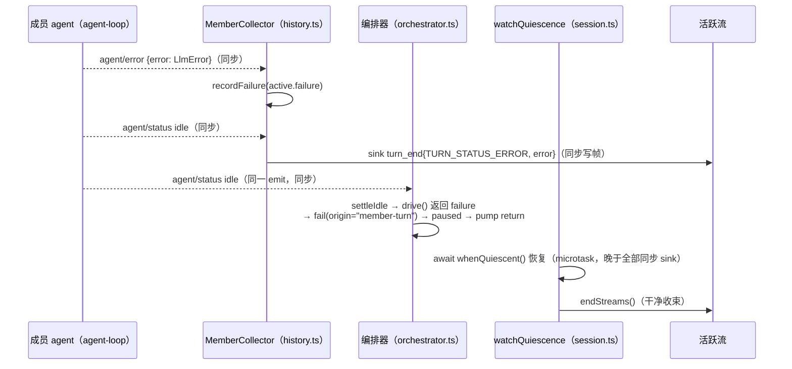

# 设计补充：session 层流收束映射（成员 turn 失败 vs 编排级失败）

**Feature**: [spec.md](spec.md) FR-010 | **修订契约**: [contracts/orchestrator-turn-outcome.md](contracts/orchestrator-turn-outcome.md) §2/§4/§5、[data-model.md](data-model.md) §4

**背景**：T023 大型测试首跑 4 用例失败的根因是 Phase 4 让成员 turn 失败进入既有 `fail()` 通道后，session 层静止点 watcher（`projects/game/agent_v2/src/session.ts` 的 `watchQuiescence`）将**所有** `failed` 静止点一律映射为 `failStreams()`（RPC INTERNAL 尾行），而大型测试的 drain 语义（`projects/game/testplan/agent_v2_helpers_test.go` 的 `drainTeamStreamAsync`，`io.EOF` 为唯一合法终止）与 spec FR-010（失败呈现保持既有语义、session 可继续）都要求成员 turn 失败以**干净收束 + turn_end ERROR 帧**呈现——与 Phase 4 之前 HEAD 的带内失败呈现一致。

## 1. 目标语义（终态）

失败静止点的流收束按**失败来源**二分：

| 失败来源 | 进入 `fail()` 的通道 | 流收束方式 | 用户可见 |
|---|---|---|---|
| 成员 turn 带内失败（LLM 请求失败，含重试耗尽、停滞超时收敛） | `drive()` 返回结果（`orchestrator.ts` runPump 结果通道） | `endStreams()` 干净收束（RPC 干净 EOF） | 既有 `turn_end{TURN_STATUS_ERROR}` 帧（history collector 先行推送）+ 结构化日志；session 可继续，再 Send 重驱保持成员 |
| 编排级失败（决策步异常、宿主注入错误、drain/不变量 throw 等编排层异常） | `runPump` 的 catch 通道 | `failStreams()` INTERNAL（**既有语义，不变**） | RPC 以 INTERNAL 收束，绝不伪装为干净 EOF（防停滞伪装设计） |

取消（cancel）静止点（`paused` 但 `lastError === null`）维持既有 `endStreams()`，不受影响。

## 2. 判别机制

### 2.1 推荐方案：`OrchestratorFailure.origin` 判别字段

在快照失败记录上增加来源字段，由 `fail()` 的两个调用点显式写入：

```ts
// common/js/dsh-plugins/saolei-loop/src/orchestrator.ts（导出）
/**
 * Where a failed orchestration step originated: the driven member's turn
 * (a band-visible LLM failure observed through agent/error) or the
 * orchestration layer itself (a thrown step). The session layer maps the
 * origin onto the stream settlement (clean end vs INTERNAL) —
 * specs/063-llm-reliability-opencode-go/contracts/orchestrator-turn-outcome.md §2.
 */
export type OrchestratorFailureOrigin = "member-turn" | "orchestration";

export interface OrchestratorFailure {
  readonly message: string;
  readonly member: TeamRole | null;
  readonly phase: OrchestrationPhase;
  readonly code: string;
  /** 失败来源：session 层流收束映射的判别字段（干净收束 vs INTERNAL）。 */
  readonly origin: OrchestratorFailureOrigin;
}
```

`fail()` 签名增加第三个参数（**通道行为本身零改动**——`paused`/成员保持/`lastError.code`/五字段日志全部不变）：

```ts
private fail(member: TeamRole | null, failure: TurnFailure, origin: OrchestratorFailureOrigin): void
```

- `runPump` 结果通道（成员 turn 失败）：`this.fail(step.member.role, failure, "member-turn")`
- `runPump` catch 通道（编排级 throw）：`this.fail(member, turnFailureOf(err), "orchestration")`

session 层判别（`watchQuiescence` 终段）：

```ts
if (snapshot.lastError?.origin === "orchestration") {
  this.failStreams(entry, snapshot.lastError);
} else {
  this.endStreams(entry);
}
```

`failed === (lastError !== null)` 既有恒等式不变；`lastError?.origin === "orchestration"` 已隐含 `failed`，判别条件比既有的 `failed && lastError !== null` 更窄（排除了 member-turn），cancel/正常静止路径不进入任一分支变化。

**推荐理由**：

1. **信息已存在，只是被合并点丢弃**：两个失败进入点在 `runPump` 内天然可区分（结果通道 vs catch），origin 是对该事实的忠实编码，零推断、零竞态。
2. **最小 API 变更**：`OrchestratorFailure` 是快照既有公共契约面（`index.ts:80` 已导出、`session.ts:46` 已 import），新增字段向后兼容；`OrchestratorSnapshot` 结构零改动。
3. **语义显式化而非行为改变**：`failStreams` 的既有 doc 注释本来就写着 "at an orchestration failure"（session.ts:697-696）——origin 字段把「什么是 orchestration failure」从注释词汇升级为可编程判别。
4. **契约面收敛**：data-model §4 `TurnFailureRecord` 单字段增补，`GetTeam` 投影（`toTeamView`，session.ts:997-1009）不消费 `lastError`，零波及。

### 2.2 备选方案与否决理由

- **备选 B——快照双通道**（`snapshot.failed` 保留给 turn 失败、新增独立 `orchestrationFailure` 字段）：`failed` 语义分裂为两个消费者各看一半，所有既有快照消费方（watcher、既有 orchestrator.test.ts 断言）都要重审；变更面大于单字段。**否决**。
- **备选 C——session 层自订 `agent/error`**（复用 `MemberCollector` 已有的成员 ctx 订阅，以「最近是否见过成员失败」判别）：观察逻辑在 session 层重复编排器职责，且引入时序耦合（watcher 静止点与 `agent/error` 到达顺序无同步保证——编排失败路径根本没有 `agent/error` 事件，判别退化为启发式）。**否决**。

### 2.3 结构化日志不加 origin（决策记录）

`OrchestrationFailureContext`（日志五字段 `{session, phase, member, code, error}`）**不**增加 origin：

- 契约 §3 与 SC-004b 断言面已冻结（signoz 查询按五字段断言存在性），加字段收益（日志侧区分两类失败）低于改契约+断言成本。
- 区分度已部分存在：member-turn 失败的 `code` 为 LlmError 稳定码（`TRANSPORT`/`QUOTA`/...），编排级 throw 多为 `UNKNOWN`。
- 如未来运维需要精确区分，可作独立增强（非本设计范围）。

## 3. 时序保证：turn_end ERROR 帧先于流收束

成员 turn 失败的完整时序（生产路径）：



`MemberCollector` 与编排器订阅**同一成员 ctx** 的同名事件；idle emit 中 collector 的 turn_end sink 是同步调用，而流收束最早发生在 watcher 的 microtask（watcher 须 `await whenQuiescent()` 等 pump promise return）。因此**帧必然先于 `endStreams` 落流**，drain 客户端总能读到带 error payload 的收尾帧。

## 4. 契约修订（已同步应用）

### 4.1 [contracts/orchestrator-turn-outcome.md](contracts/orchestrator-turn-outcome.md)

- **§2**：时序图 `fail()` 通道框标注 `origin="member-turn"`；bullet 列表新增两条——`fail()` 的 origin 语义（结果通道 `"member-turn"` / catch 通道 `"orchestration"`）与 **session 层流收束映射**条款（含 turn_end 帧在场论证、`"orchestration"` 保留 failStreams INTERNAL 的防伪装语义引用、排队消息在失败静止点不消化的 FR-010 语义）。
- **§4**：`lastError` 增加origin 字段说明；web 呈现条款补充「成员 turn 失败的流干净收束使 turn_end ERROR 成为收尾帧——与 HEAD 带内失败呈现一致，零新增前端工作」。
- **§5**：新增第 7 条 session 层测试义务（harness 扩展 + 干净收束用例 + 编排失败回归）。

### 4.2 [data-model.md](data-model.md) §4

`TurnFailureRecord` 增加 `origin: "member-turn" | "orchestration"` 字段（契约指向 orchestrator-turn-outcome.md §2 流收束映射）。

## 5. 测试义务

### 5.1 session 层单测（`projects/game/agent_v2/src/session.test.ts`）

1. **harness 扩展**：`fakeMember`（:78-147）的 `ctx.on` 增加 `agent/error` 分支（`errorListeners` 数组 + off），`MemberFake` 增加 `failCurrentTurn(code: string)`——emit `agent/error`（payload `{agent, error: LlmError 形态}`）后 `settle()`（emit idle），镜像 `orchestrator.test.ts:90-151` 手法。扩展后 `MemberCollector` 与编排器两个订阅者同时可见（同一 fake ctx）。
2. **新用例（member-turn → 干净收束）**：Send 启动 planner turn → `failCurrentTurn("SERVER")` → 断言：
   - 流干净收束：`stream.ended === true` 且 `stream.failures` 为空；
   - `turnEnd` 帧在场：`stream.events` 尾部有 `turnEnd{status: TURN_STATUS_ERROR, error: {code: "SERVER", ...}}`（harness 内 MemberCollector 真实推送）；
   - 结构化日志恰一条（`loggerError` 一次、五字段含 `code`）——FR-012 不因收束方式改变；
   - activation 保持：`getTeam(S1).activeMember === "planner"`；
   - 再 Send 重驱同成员：`planner.followups` 追加、新流正常应答（COMPLETED turn_end）。
3. **既有编排失败用例回归**：`"breaks out of a paused, failed orchestration with a stream error..."`（:885，`followup` throw → catch 通道）不变即验证 `origin="orchestration"` 仍走 failStreams INTERNAL。

### 5.2 orchestrator 层单测（`common/js/dsh-plugins/saolei-loop/src/orchestrator.test.ts`）

既有失败用例的 `lastError` 断言补 `origin` 字段：`failCurrentTurn` 系用例断言 `"member-turn"`；`drain read failed` / `drive exploded` 系（throw）断言 `"orchestration"`。

### 5.3 大型测试

**无需改动**。4 个失败用例即为验收（T023 修复循环内重跑 `guitar run projects/game/testplan/system_test.yaml`）：

- `TestAgentV2TeamMemberFailureRecovers` / `TestAgentV2TeamInterruptedTurnBackfillsTail`（既有，HEAD 语义回归）；
- `TestAgentV2TeamPlannerFailureRetainsActivation`（SC-002）；
- `TestAgentV2TeamNonTransientFailureStaysVisible`（SC-005 quota/auth）。

未运行的 SC-004a stall 用例同享 drain 模式：停滞超时经适配器 `idleWatchdog` 归一为 `LlmError` → 重试耗尽 → agent-loop 以 `agent/error` + idle 收束（结果通道）→ `"member-turn"` → 干净收束，同样被本设计覆盖。

## 6. 影响评估（已合入产物的小改清单）

| 文件 | 变更 | 性质 |
|---|---|---|
| `common/js/dsh-plugins/saolei-loop/src/orchestrator.ts` | 导出 `OrchestratorFailureOrigin`；`OrchestratorFailure` 增 `origin`；`fail()` 第三参数；两个调用点传值 | 字段增补，fail 通道行为零改动 |
| `common/js/dsh-plugins/saolei-loop/src/index.ts` | 导出类型列表 += `OrchestratorFailureOrigin` | 导出面增补 |
| `common/js/dsh-plugins/saolei-loop/src/orchestrator.test.ts` | 失败用例断言补 `origin` | 断言增补 |
| `projects/game/agent_v2/src/session.ts` | `watchQuiescence` 终段判别改 `lastError?.origin === "orchestration"`；`watchQuiescence`/`failStreams` doc 注释同步（收束语义二分表述） | 判别条件收窄 + 注释终态化 |
| `projects/game/agent_v2/src/session.test.ts` | harness 扩展 + 新用例（§5.1） | 测试增补 |
| `specs/063-llm-reliability-opencode-go/contracts/orchestrator-turn-outcome.md`、`data-model.md` §4 | 本设计已应用 | 契约修订 |

**明确不动**（边界）：

- `fail()` 通道本身（`paused`/成员保持/`lastError.code`/五字段结构化日志）；
- `specs/059-agent-v2-team-mode/contracts/team-api.md` §6 错误语义（编排失败 INTERNAL 映射）；
- web 前端（`web/frontend/src/store/chat.ts:679` 既有 `TURN_STATUS_ERROR` 处理即目标呈现，测试已覆盖）；
- 大型测试代码与 testplan YAML；
- `quickstart.md` / `spec.md`（SC-002 验收行「turn_end ERROR；GetTeam activation=planner；再 Send 由 planner 应答」与本设计终态一致，无需修订）。

## 7. 执行建议（tasks.md 增补文本，供采纳）

建议在 tasks.md Phase 4 追加（承载本次修复的代码变更，位于 T011 之后）：

```markdown
- [ ] T011a [US2] 流收束判别：`orchestrator.ts` 导出 `OrchestratorFailureOrigin`、`OrchestratorFailure` 增 `origin` 字段、`fail()` 第三参数（结果通道 "member-turn" / catch 通道 "orchestration"，通道行为零改动）；`index.ts` 导出增补；`session.ts` `watchQuiescence` 按 `lastError.origin === "orchestration"` 判别 failStreams（其余 endStreams 干净收束，含 member-turn 失败——turn_end ERROR 帧先于收束在场）；`orchestrator.test.ts` 断言补 origin；`session.test.ts` fake member 扩展 `agent/error` listeners + `failCurrentTurn` 并新增 member-turn 干净收束用例（契约：specs/063-llm-reliability-opencode-go/contracts/orchestrator-turn-outcome.md §2/§4/§5、data-model.md §4；设计：specs/063-llm-reliability-opencode-go/design-session-stream-settlement.md）
```

文档清单（该 task 执行前必读）：`style/javascript.md`；`specs/063-llm-reliability-opencode-go/contracts/orchestrator-turn-outcome.md`（修订后）、`specs/063-llm-reliability-opencode-go/data-model.md` §4、本设计文档、`common/js/dsh-plugins/saolei-loop/src/orchestrator.ts`（现状代码）、`projects/game/agent_v2/src/session.ts`（现状代码）。

## 8. 验证门禁

1. `bazel test //common/js/dsh-plugins/saolei-loop:lib_test`（origin 断言 + 既有 62 用例回归）；
2. `bazel test //projects/game/agent_v2:lib_test`（新用例 + 既有回归）；
3. T023 重跑：`guitar run projects/game/testplan/system_test.yaml` 全绿（宪章 VI：全部用例通过方为验收）。
