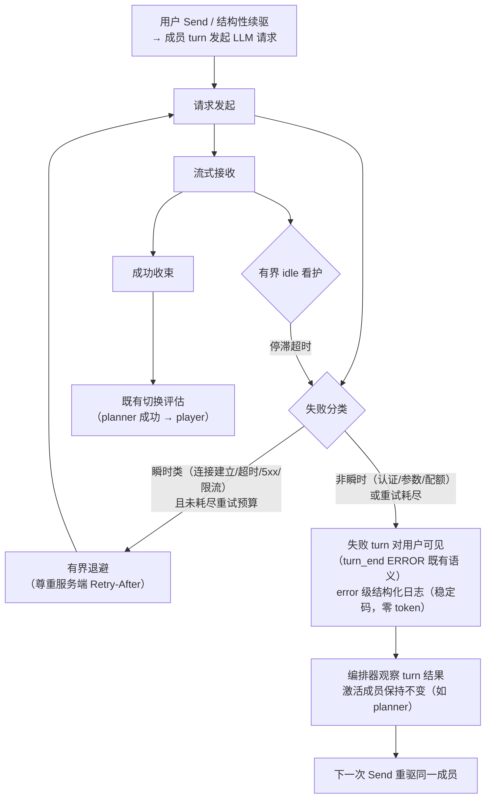

# Feature Specification: LLM 请求发送可靠性修复与 opencode-go 模型接入

**Feature Branch**: `063-llm-reliability-opencode-go`

**Created**: 2026-09-12

**Status**: Draft

**Input**: User description: "当前 @common/js/dsh-plugins/llm-glm/ Send 操作请求经常会失败，但运行中的话几乎没有连接不稳的问题。另外就是 agent-v2 在发送 llm 请求失败时也会切换 member。例如启动游戏时，如果 planner 请求 llm 失败了，那么在此发送时几乎成员就成了 player。另外有个需求，新增一个 llm 插件，接入 opencode-go 的模型，默认 endpoint 说明：https://opencode.ai/docs/zh-cn/go/ ，token提供方式与 llm-glm 类似。" 补充调研要求：(a) 对比官方 llm 请求插件（dsh-llm-deepseek），检查我们的 llm 插件缺少了哪些设计；(b) 检查 glm llm 请求错误的日志。

## Motivation

两个生产缺陷 + 一个新能力，全部位于 agent-v2 的 LLM 请求通路（llm-glm 适配器 → dsh agent-loop → saolei-loop 编排器）：

### 现状证据（源码级，2026-09-12）

1. **llm-glm 的失败分类与重试机制完全不匹配 → 一次瞬时网络抖动 = 用户可见失败 turn**。组合清单中已启用官方重试插件 `llm-retry`（`projects/game/agent_v2/cordis.yml:40`），其策略来自适配器路由注册：适配器未声明时回退默认策略，默认可重试码集合为 `[EMPTY_RESPONSE, RATE_LIMIT, SERVER, TIMEOUT, TRANSPORT]`（`node_modules/.pnpm/@deepseek-ai+dsh-llm@0.1.1-rc.2_*/node_modules/@deepseek-ai/dsh-llm/lib/index.js:360-365, 1208`）。而 llm-glm 抛出的 `LlmError` 码是 `GLM_TRANSPORT` / `GLM_HTTP_<status>` / `GLM_PROTOCOL`（`common/js/dsh-plugins/llm-glm/src/adapter.ts:132-135, 145-148, 193-201`），带内失败码为 provider 原码或 `GLM_PROVIDER_ERROR`——**全部落在默认可重试集合之外，重试从未触发**。用户观察"Send（新请求发起）经常失败、流式进行中连接稳定"正是连接建立类瞬时失败的典型表现。
2. **编排器不看 turn 成败 → planner 失败后被静默切到 player**。`runPump` 的 `drive()` 只等待成员 idle 转移（`common/js/dsh-plugins/saolei-loop/src/orchestrator.ts:699-720, 820-852`）；模型请求失败在 agent-loop 内以 `turn/end{error}` + idle 收束、不抛出（错误仅被 web 可见的历史收集器消费，`projects/game/agent_v2/src/history.ts:629-635, 764-805`）。于是 `nextStep()` 的 `planning/reviewing → playing` 切换无条件执行（`orchestrator.ts:789-794`）：游戏启动时 planner 首个 LLM 请求失败 → 激活已切 player → 下一次 Send 由 player 应答，规划回合被静默跳过。
3. **LLM 失败在日志/traces 中零可观测**。生产实证（SigNoz，2026-09-12 查询，`game/agent-v2` @ `game.prod`，近 7 天，运行时数据不在仓库内）：error/warn 日志共 8 条，全部为 bootstrap/infra 类（deploy service 503/timeout、shutdown budget），无一含 GLM 字样；容器控制台输出同样无 GLM 请求错误；traces 仅覆盖 gRPC 入站 handler，出站 LLM fetch 无任何 span。GLM 请求失败只存在于 dsh session 事件与推给 web UI 的 `turn_end{ERROR}` 帧——用户报告的"经常失败"目前无法从日志侧诊断。同窗口内 bootstrap 组件（preset-store、dsh）也曾出现 503/timeout/fetch failed 后重试成功，佐证该环境存在瞬时网络不稳，会同样打击 LLM 连接建立。
4. **对比官方适配器（dsh-llm-deepseek，本地物化 `node_modules/.pnpm/@deepseek-ai+dsh-llm-deepseek@0.1.1-rc.2_*/lib/index.js`）的缺失设计**：
   - 失败码分类对齐共享分类学：HTTP 401/403→`AUTH`、429→`RATE_LIMIT`、5xx→`SERVER`、配额措辞→`QUOTA`、超上下文→`CONTEXT_WINDOW_EXCEEDED`（`:1308-1324`）——全部落在重试决策可用的稳定码上；llm-glm 的 `GLM_*` 码则不可路由。
   - `providerRetryPolicy` 声明（`:1346-1348`）：按 provider 声明可配置重试策略；llm-glm 未声明，依赖隐式默认且码集永不命中。
   - 流停滞看护（idleWatchdog，`:1403, 1418`）：连接存活但无数据的停滞在 `streamIdleTimeoutMs`（默认 5 分钟）内转为 `TIMEOUT`（可重试）；llm-glm 无任何 idle 界限——停滞将无限挂起（v1 栈的 043/044 停滞恢复机制随 v1 移除而消失，v2 目前无此能力）。
   - `Retry-After` 头尊重（`:1289-1297`）：解析服务端指示的退避并交给重试决策；llm-glm 忽略。
   - 空补全分类（`:997-1007`）：正常完成但零输出 → `EMPTY_RESPONSE`（可重试失败），而非成功空回合；llm-glm 会产出零块的成功 turn。
   - 消费方停止时的传输清理（`:1422-1427`）：consumer 停止即 abort 底层传输并关闭迭代器；llm-glm 仅 `releaseLock`，不取消 body。
   - 凭据/设置热更新（`ctx.credentials`/`ctx.settings`，每请求解析连接事实，`:1775-1814`）：llm-glm 采用宿主 env 注入（specs/049 D9 的既定决策，用户对新插件也裁定 token 提供方式与 llm-glm 类似）——**有意分歧，保持**。
5. **opencode-go 网关未接入**（https://opencode.ai/docs/zh-cn/go/ ）：默认 endpoint `https://opencode.ai/zen/go/v1`，按模型分三种线协议路由（OpenAI Chat Completions / OpenAI Responses / Anthropic Messages），token 经订阅获取、以请求头携带；现有插件仅覆盖 GLM codingplan。

### 目标与现状的差距

| 维度 | 现状 | 目标 |
|---|---|---|
| 瞬时请求发起失败 | 一次抖动即用户可见失败 turn，重试永不触发 | 有界自动重试（尊重服务端退避指示），单次瞬时失败用户无感 |
| 失败分类 | `GLM_*` 私有码，重试决策不可路由 | 稳定失败码对齐共享分类学（可重试/不可重试可判定） |
| 流停滞 | 无任何看护，停滞即无限挂起 | 有界 idle 检测，转为可重试失败 |
| 失败可观测 | 零日志、零 tracing，仅 UI 帧可见 | error 级结构化日志（稳定码、无 token 泄漏） |
| 失败后的团队状态 | planner 失败被静默切到 player | 激活成员保持，失败可见，下次 Send 重驱同一成员 |
| 模型接入 | 仅 GLM codingplan | 新增 opencode-go 插件（token 提供方式与 llm-glm 类似） |

## User Scenarios & Testing *(mandatory)*

### User Story 1 - Send 瞬时失败自动恢复 (Priority: P1) 🎯 MVP

用户（或编排器的结构性续驱）发起一次 LLM 请求，请求发起阶段遭遇瞬时故障（连接建立失败、超时、服务端 5xx、限流）。系统在内部自动重试（有界次数、有界退避、尊重服务端退避指示），单次瞬时故障对用户不可见——turn 正常完成、内容完整。仅当故障持续超过重试预算、或失败类别判定为非瞬时（认证失败、请求非法、配额耗尽）时，才以既有失败 turn 语义对用户可见。

**Why this priority**: 用户报告的最高频痛点（"Send 操作请求经常会失败"）；重试永不触发是根因，修复它即可消除绝大多数用户可见失败。

**Independent Test**: 对 fake LLM 端点注入单次请求发起瞬时失败（首尝试失败、重试成功），断言 turn 正常完成、无失败帧、无重试痕迹泄漏到用户消息流；注入持续性失败，断言有界重试后以失败 turn 可见（既有语义）。

**Acceptance Scenarios**:

1. **Given** 一次 LLM 请求发起失败且类别为瞬时（连接建立/超时/5xx/限流），**When** 系统执行有界重试，**Then** 在预算内的后续尝试成功时，用户看到的是正常完成的 turn（无错误帧、无内容缺失）。
2. **Given** 失败类别为非瞬时（认证失败、请求非法、配额耗尽），**When** 请求失败，**Then** 不重试（或不在同类上反复重试），失败 turn 按既有语义对用户可见。
3. **Given** 瞬时失败持续直至重试预算耗尽，**When** 最后一次尝试失败，**Then** 恰出现一次失败 turn（既有 turn_end ERROR 语义），不产生重复/叠加的失败呈现。
4. **Given** 服务端在限流响应中指示了退避时间，**When** 系统重试，**Then** 退避等待尊重该指示（不超过策略上限）。
5. **Given** 用户主动取消（Cancel），**When** 请求在途，**Then** 立即按既有 abort 语义终止，不触发重试，不改变取消呈现。

---

### User Story 2 - LLM 失败不改变团队激活成员 (Priority: P1)

游戏启动后处于规划阶段，planner 的首个 LLM 请求失败（含重试耗尽后的失败）：失败对用户可见（turn 错误呈现），但团队激活成员保持为 planner——下一次 Send 仍由 planner 应答并重新执行规划；planner 成功完成规划回合后，才按既有语义切换到 player。任何成员（含 player 自身、复盘中的 planner）的 turn 失败均适用同一保持语义。同时，失败必须在服务侧留下 error 级结构化日志（含稳定失败码，不含任何凭据内容），使"经常失败"可从日志侧诊断。

**Why this priority**: 正确性缺陷——失败被静默吞掉并腐化团队状态（规划回合被跳过）；且当前失败零日志，运维无法诊断。与 US1 互补：US1 降低失败频率，US2 保证残余失败的团队状态正确与可诊断。

**Independent Test**: 注入 planner 首个 LLM 请求持续失败，断言：失败 turn 可见、团队激活成员保持 planner（团队状态查询与实际路由一致）、下一次 Send 由 planner 应答；解除注入后 planner 正常完成规划并切换 player。日志侧断言出现含稳定失败码的 error 级日志。

**Acceptance Scenarios**:

1. **Given** 游戏启动处于 planning 阶段且 planner 的 LLM 请求失败，**When** turn 以错误收束，**Then** 激活成员保持 planner，planner→player 切换不发生。
2. **Given** planner 失败后用户再次 Send，**When** 消息入队，**Then** 由 planner（而非 player）应答，规划回合重新执行。
3. **Given** planner 成功完成规划回合，**When** turn 正常收束，**Then** 既有切换语义照常（切换到 player 开始游戏）。
4. **Given** 任一成员（player 游戏中、planner 复盘中）的 turn 失败，**When** turn 以错误收束，**Then** 激活成员同样保持，不发生结构性续驱的静默转移。
5. **Given** 成员 turn 因 LLM 失败收束，**When** 检查服务日志，**Then** 存在 error 级结构化记录（稳定失败码、成员身份、会话标识；不含 token 值）。
6. **Given** 用户主动 Cancel 导致的 turn 终止，**When** 编排器评估，**Then** 既有取消语义保持，不按失败保持语义处理。

---

### User Story 3 - opencode-go 模型接入 (Priority: P2)

运维者为 agent-v2 配置新的 LLM 插件以使用 opencode-go 订阅网关的模型：默认 endpoint 按官方文档（`https://opencode.ai/zen/go/v1`），token 以环境变量由宿主 bootstrap 注入（与 llm-glm 的提供方式一致：声明环境变量名，空值容忍、缺失时请求照常发出、认证失败以可见错误呈现）。两插件部署即共存：用户通过既有模型选择面在一份联合目录中选择模型——所有已注册 provider 的模型以 `provider/model` 复合标识扁平呈现（或 provider/model 二级级联），页面不感知插件实现；成员选用 opencode-go 模型后完成完整会话（规划、游戏、工具调用）。

**Why this priority**: 新能力，扩大模型供给（glm/kimi/deepseek/longcat/mimo/hy 系列共 16 个订阅制模型，见 FR-015 v1 目录）；依赖 US1 的失败分类与重试设计在新插件上同等生效。

**Independent Test**: 以 fake 端点模拟 opencode-go 线协议，配置插件后断言：模型目录可见、成员选用后完成含工具调用的多轮会话、token 条件携带与零泄漏、模型目录外 id 的 advisory 解析行为与 llm-glm 一致。

**Acceptance Scenarios**:

1. **Given** 插件已配置（endpoint + token 环境变量名 + 模型目录），**When** 用户查询可选模型，**Then** 选择面呈现全部已注册 provider 的联合目录（`provider/model` 复合标识，扁平或级联），其中含 opencode-go 目录的模型；跨 provider 同名模型以 provider 前缀消歧，选择结果路由到所选 provider。
2. **Given** 成员选用 opencode-go 模型，**When** 会话进行，**Then** 文本与推理输出、工具调用往返、usage 呈现与既有 GLM 体验一致。
3. **Given** token 环境变量未设置或为空，**When** 请求发出，**Then** 请求不携带凭据头、照常发出，真实端点的认证失败以可见错误呈现（与 llm-glm 条件携带语义一致）。
4. **Given** token 已设置，**When** 检查请求与全部错误呈现/日志，**Then** token 值零出现。
5. **Given** 模型 id 不在配置目录中，**When** 插件解析层解析该模型，**Then** 以最小元数据 advisory 解析（不拒绝），与 llm-glm 语义一致；选择面写入校验仍按部署目录强校验。
6. **Given** 网关限流/配额类失败，**When** 请求失败，**Then** 按 US1 的分类语义处理（限流类瞬时重试、配额耗尽类可见失败且不无界重试）。

### Edge Cases

- **重试预算内全部失败**：恰一次失败 turn 呈现（US1 场景 3）；激活成员保持（US2）。
- **失败时有排队消息**：排队消息在成员保持语义下仍由原激活成员消化（既有 FIFO 语义不变）。
- **复盘驱动（pendingReview）失败**：与普通成员 turn 同一保持语义，不丢失复盘触发记录。
- **流中途带内失败（已输出部分内容后 provider 报错）**：既有 interrupted 呈现保持；失败分类与成员保持语义同样适用。
- **流停滞（连接存活、无数据）**：在有界 idle 窗口内转为可重试失败；窗口内正常的长思考间隔（推理模型首输出前的长时间静默）不误判——阈值取行业校准值并在配置中可调。
- **正常完成但零输出**：分类为可重试失败，不产出成功的空回合。
- **消费方提前停止读取**：底层传输被及时清理，不保留悬挂连接。
- **opencode-go 目录外模型 id**：advisory 解析（不拒绝）。
- **跨 provider 同名模型（如 glm-5.3 同时在 GLM codingplan 与 opencode-go）**：选择面以复合标识的 provider 前缀消歧，请求路由到所选 provider 的端点。
- **opencode-go 配额窗口耗尽**：可见错误呈现，不做无界重试。

## Requirements *(mandatory)*

### Functional Requirements

**失败分类与重试（US1）**

- **FR-001**: LLM 请求失败 MUST 按稳定失败码分类，且瞬时类别（连接建立/传输失败、超时、服务端 5xx、限流）与不可重试类别（认证失败、请求非法、配额耗尽）MUST 可被重试决策区分路由。
- **FR-002**: 瞬时类别的失败 MUST 触发有界自动重试（有限次数、有界退避、带抖动）；重试在既有 turn 语义内进行，成功后用户无失败感知。
- **FR-003**: 服务端在限流响应中指示的退避时间 MUST 被解析并尊重（不超过策略上限）；无指示时使用本地有界退避。
- **FR-004**: 非瞬时类别 MUST 不触发同类重试；重试预算耗尽后 MUST 以恰一次失败 turn 呈现（既有错误可见语义）。
- **FR-005**: 用户主动取消 MUST NOT 触发重试，既有取消呈现保持。
- **FR-006**: 流式接收停滞（连接存活但无数据到达）MUST 在可配置的有界 idle 窗口内检测并转为超时类失败（进入 FR-001/FR-002 的分类与重试）；窗口阈值 MUST 容忍推理模型的正常长静默（默认取行业校准值）。
- **FR-007**: 正常完成但零内容块的补全 MUST 分类为空响应类失败（可重试），MUST NOT 产出成功的空回合。
- **FR-008**: 消费方停止消费流时，底层传输 MUST 被及时取消/清理。

**失败后的团队状态（US2）**

- **FR-009**: 成员 turn 以失败收束时（含重试耗尽），编排器 MUST 保持激活成员不变；结构性成员切换 MUST 仅在成员 turn 成功收束后发生。
- **FR-010**: 失败 turn 的错误呈现（用户可见）MUST 保持既有语义；存在排队消息时，MUST 由保持的激活成员按既有 FIFO 语义消化。
- **FR-011**: 编排器 MUST 能观察成员 turn 的成败结果（而非仅 idle 到达）作为切换评估输入。
- **FR-012**: 成员 turn 因 LLM 失败收束时，服务侧 MUST 产生 error 级结构化日志，包含稳定失败码、成员身份、会话标识；MUST NOT 包含任何凭据值。

**opencode-go 插件（US3）**

- **FR-013**: 系统 MUST 提供新的 LLM 适配插件接入 opencode-go 网关：默认 endpoint 按官方文档（`https://opencode.ai/zen/go/v1`，可配置覆盖）；token 以环境变量名声明、宿主 bootstrap 注入，条件携带语义与 llm-glm 一致（空值不携带凭据头、照常请求；认证失败可见）。
- **FR-014**: 插件 MUST 提供显式静态模型目录（id + 上下文窗口），经既有模型选择面（ListModels / UpdateTeam 校验）呈现；插件解析层对目录外 id MUST 以 advisory 解析（resolveModel 返回最小元数据、不拒绝），选择面写入校验仍按部署目录强校验（错误信息提示复合标识形态）。
- **FR-015**: 插件 v1 仅覆盖 OpenAI Chat Completions 线协议（用户裁定，见 Clarifications Session 2026-09-12）：默认目录 MUST 仅含该协议路由的模型（官方文档 API 端点表中的 glm/kimi/deepseek/longcat/mimo/hy 系列，共 16 个）；OpenAI Responses 路由（grok/gpt/muse 系列）与 Anthropic Messages 路由（qwen/minimax 系列）的模型 MUST NOT 出现在默认目录中。
- **FR-016**: FR-001–FR-012 的失败分类、重试、看护与可观测要求 MUST 对新插件同等生效。
- **FR-017**: 请求 MUST 携带稳定会话标识头（按网关官方建议，用于路由与提示缓存优化）与可识别的客户端标识。
- **FR-018**: 模型选择面 MUST 以 `provider/model-id` 复合标识呈现全部已注册 provider 的模型目录（扁平列表或 provider/model 二级级联），调用方与 web 页面不感知 provider 插件实现；复合标识 MUST 在服务侧分解为结构化 (provider, model) 路由（对齐 dsh 既有维度），跨 provider 同名模型 MUST 由 provider 前缀消歧且路由到所选 provider。

### Key Entities

- **LLM 适配插件配置**: endpoint 基址、token 环境变量名、静态模型目录（id + 上下文窗口）、重试/看护策略参数；与宿主组合行（cordis.yml）的注入关系同 llm-glm 既有模式。
- **模型选择标识**: `provider/model-id` 复合形式，选择面与 API 的呈现单位；服务侧分解为 dsh 结构化 (provider, model) 路由对（FR-018）。
- **稳定失败码**: LLM 请求失败的机器可路由分类（传输/超时/服务端/限流/认证/配额/空响应/协议），重试决策与日志消费方共同依赖；对齐 dsh 共享分类学。
- **团队激活状态**: phase（planning/playing/reviewing）+ 激活成员；转移仅由成员 turn 成功收束驱动（FR-009/FR-011）。

## Success Criteria *(mandatory)*

### Measurable Outcomes

- **SC-001**: 对每次 turn 注入恰一次瞬时请求发起失败的测试场景中，100% 的 turn 经自动重试后正常完成（用户无失败感知、无内容缺失）。
- **SC-002**: 游戏启动时注入 planner 首个 LLM 请求持续失败的场景中，100% 的后续 Send（首次成功规划前）由 planner 应答，团队状态查询报告的激活成员始终为 planner。
- **SC-003**: 以 opencode-go 模型配置有效 token 后，可完成包含规划、多局游戏与工具调用的完整会话，无归因于适配协议的错误；token 值在全部消息、错误与日志中零出现。
- **SC-004a**: 流停滞场景在配置窗口内 100% 被检测并按超时类处理。
- **SC-004b**: 成员 LLM 失败 turn 100% 伴随一条含稳定失败码的 error 级日志。
- **SC-005**: 非瞬时失败（认证/配额）不产生重试风暴（同类重试次数为 0 或不增加失败呈现次数）。

## Assumptions

- "瞬时"分类采用业界共识默认：传输/连接建立失败、超时、HTTP 5xx、限流（429 类）可重试；认证失败、请求非法、配额/余额耗尽、超上下文不可重试。具体类别归属在 plan 阶段依据 dsh 共享分类学落定。
- 重试在既有 dsh llm-retry 扩展点的 turn 语义内执行（官方 deepseek 适配器同型）；不引入新的重试框架。
- 流停滞 idle 窗口默认值取行业校准区间（≥120s，推理模型长静默容忍），配置可调；不沿用 043 的 30s 激进默认。
- 成员保持语义与编排器既有 fail 暂停/再驱动语义对齐（specs/059 既有"可再次驱动"语义的实现落地），不新增用户可见状态机概念。
- opencode-go token 提供方式沿用 llm-glm 模式（宿主 env 注入 + 三级解析容忍），不接入 dsh credentials/settings 体系（specs/049 D9 既定分歧，用户已裁定保持）。
- opencode-go 模型目录为静态配置（同 llm-glm）：默认目录覆盖官方文档 Chat Completions 路由的全部 16 个模型（完整清单与 contextWindow 见 `specs/063-llm-reliability-opencode-go/contracts/opencode-go-plugin.md` §2）；仅见于网关 `/models` 的未文档化 id 与 Responses/Anthropic Messages 路由模型不收录；动态模型发现（拉取网关 `/models`）不在 v1 范围。
- LLM 失败日志按结构化 error 级落既有服务日志通道；出站 LLM 调用的 tracing 覆盖为可选增强，不在本 feature 验收范围。
- 模型选择面复用既有 RPC 与页面骨架，但其模型标识升级为 `provider/model` 复合形式（FR-018）：联合目录跨已注册 provider 聚合、选择与校验按复合标识分解路由；web 页面以扁平列表或 provider/model 级联呈现，不感知插件实现。
- 默认成员模型保持现行为（GLM provider 既有默认，`GLM_MODEL` 语义不变）；opencode-go 侧以同型环境变量声明其默认模型，未选择时成员不路由到 opencode-go。
- agent-v2 为服务型应用，大型测试（fake LLM 注入失败/停滞/新插件端点模拟）作为验收组成（style/large_test.md）。

## Clarifications

### 调研结论（源码级，2026-09-12）

- 重试机制已在组合中运行但永不命中：`llm-retry` 插件经 `agent/request-error` 扩展点执行 provider 路由策略，策略为空时回退默认（可重试码 `[EMPTY_RESPONSE, RATE_LIMIT, SERVER, TIMEOUT, TRANSPORT]`）；llm-glm 的 `GLM_*` 码全部在集合外。依据：`node_modules/.pnpm/@deepseek-ai+dsh-llm@0.1.1-rc.2_*/node_modules/@deepseek-ai/dsh-llm/lib/index.js:356-365, 1208`；`node_modules/.pnpm/@deepseek-ai+dsh-llm-retry@0.1.1-rc.2_*/node_modules/@deepseek-ai/dsh-llm-retry/lib/index.js:118-155`；`common/js/dsh-plugins/llm-glm/src/adapter.ts:132-201`。
- 官方 deepseek 适配器的完整设计先例（失败码分类、providerRetryPolicy、idle 看护、Retry-After、空补全分类、传输清理、凭据热更新）见 Motivation §4；其凭据/设置热更新与 llm-glm 的 env 注入分歧为 specs/049 D9 既定决策，保持。
- 生产日志实证（SigNoz `game/agent-v2` @ `game.prod`，2026-09-12 查询，近 7 天）：error/warn 共 8 条全为 bootstrap/infra 类，无 GLM 请求错误；traces 仅 gRPC 入站。LLM 失败零日志可观测（Motivation §3，运行时数据不在仓库内）。
- opencode-go 网关事实（https://opencode.ai/docs/zh-cn/go/ 与网关 `/models` 实测）：默认 endpoint `https://opencode.ai/zen/go/v1`；三种线协议按模型分流（Chat Completions / Responses / Anthropic Messages，认证头分别为 `Authorization: Bearer` ×2 与 `x-api-key`）；限流为按模型的美元配额窗口（5 小时/周/月），超出即阻断；官方建议携带自定义 User-Agent 与稳定会话头（`x-opencode-session`）。
- specs/043/044 的流停滞看护位于 agent v1（LangGraph 栈），v1 已于 059 全量移除，v2 现状无停滞检测能力；官方适配器的 adapter 级 idleWatchdog 为 v2 的对齐先例。
- dsh core 多 provider 管理（本地物化 0.1.1-rc.2，`@deepseek-ai/dsh-llm` `lib/index.js` LlmRuntime 段与 README）：provider route 注册表（`registerAdapter` 按 route 互斥、`DUPLICATE_ADAPTER`）、`listProviders()`、按 provider 的 `listModels`/`resolveModelInfo`；请求路由为结构化 `(provider, model)` 对（`GenerateOptions.provider` 选适配器、`GenerateOptions.model` 适配器解释），core 无组合字符串先例。官方多 endpoint 管理走 `registerConfigurableProviders`（settings profile 目录，registered/dormant）+ credentials + 模型发现——本仓库对 settings/credentials 体系保持 specs/049 D9 分歧（env 注入），路由共存用 core 原生能力。agent_v2 现状为单 provider 硬编码（`projects/game/agent_v2/src/session.ts:62,68`，`PROVIDER='glm-responses'`、`DEFAULT_MODEL` 裸 id），选择面升级见 FR-018。

### Session 2026-09-12

- Q: 对比官方 llm 插件，我们的 llm 插件缺少哪些设计？ → A: 见 Motivation §4 与 Clarifications 调研结论——缺失败码分类对齐、providerRetryPolicy 声明、流停滞看护、Retry-After 尊重、空补全分类、消费方停止的传输清理、失败可观测；凭据/设置热更新为有意分歧（保持）。
- Q: glm llm 请求错误的日志情况？ → A: 零可观测——应用日志与容器控制台均无 GLM 请求失败记录，traces 无出站 LLM span（Motivation §3）；FR-012 由此而来。
- Q: opencode-go 插件 v1 的线协议覆盖范围？ → A: 仅 OpenAI Chat Completions（Option A）——工作量最小且官方 dsh-llm-deepseek 即此协议、有完整先例；默认目录覆盖该协议路由全部 16 个文档化模型（glm/kimi/deepseek/longcat/mimo/hy 系列），与当前 GLM 用模重叠最大。Responses 与 Anthropic Messages 路由模型排除出默认目录（FR-015），后续 feature 可扩展。
- Q: 新增 opencode-go 插件后，系统在部署与使用上应如何组织两个模型来源（现有 GLM 插件与新插件）的关系？ → A: Option C——模型选择标识采用 `provider/model-id` 复合形式；web 页面不感知 provider 插件，所有已注册 provider 的模型以扁平列表（或 provider/model 二级级联）呈现；复合标识在服务侧分解为 dsh 结构化 (provider, model) 路由对，跨 provider 同名模型（如两网关均有 glm-5.3）由前缀消歧（FR-018）。
