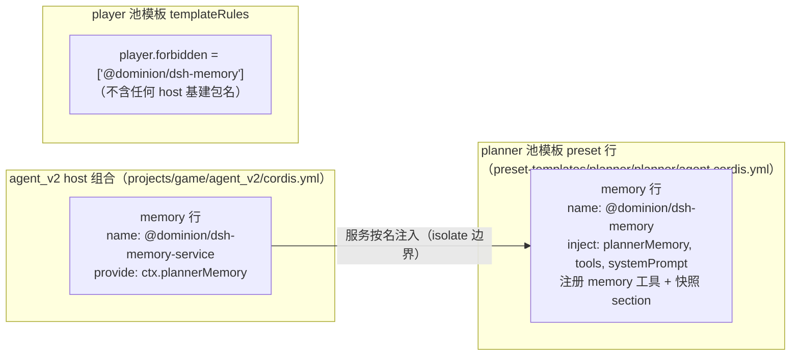
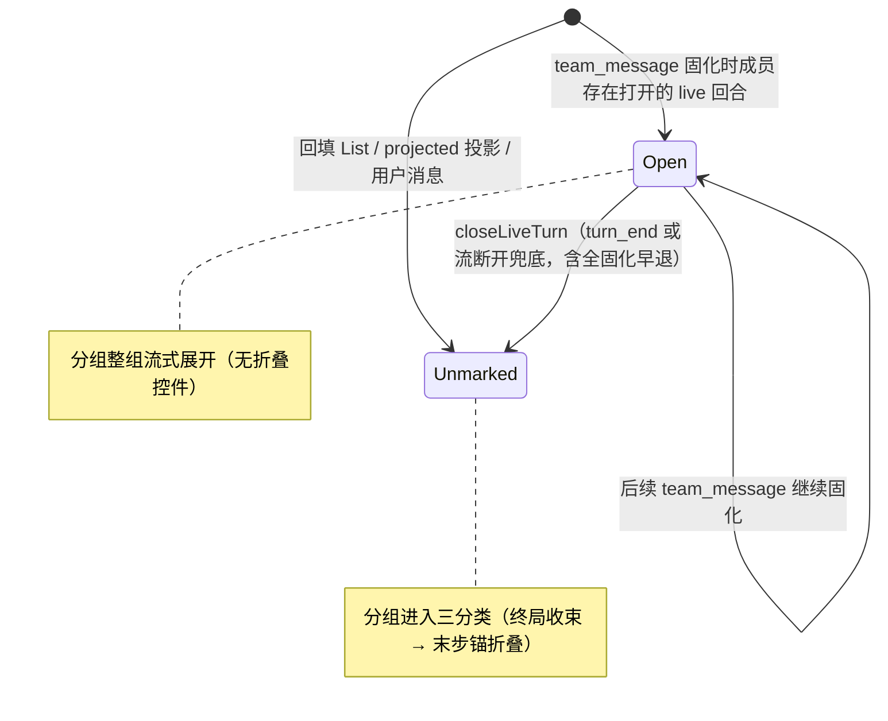

# Data Model: memory 插件拆分 + 终局回合折叠 + remain 语义澄清

> Phase 1 输出。实体与验证规则源自 [spec.md](spec.md) FR-001..FR-008；拆分文件归属决策见 [research.md](research.md) D1/D3。

## 1. 插件包实体（拆分终态）

### 1.1 `@dominion/dsh-memory-service`（新增，`common/js/dsh-plugins/memory-service/`）

| 文件 | 内容 | 来源 |
|---|---|---|
| `src/client.ts` | `MemoryClient`（memory 服务 gRPC 客户端）、`MemoryStore`/`MemoryEntry` 类型、`MEMORY_SERVICE_TARGET`、`memoryName` | 迁自 memory 包（原样） |
| `src/operations.ts` | `MEMORY_ACTIONS`、`applyMemoryCall`、`matchBySubstring`、`generateMemoryId`、`MemoryAction`/`MemoryOp`/`MemoryToolArgs` | 迁自 memory 包（原样） |
| `src/snapshot.ts` | `renderMemorySnapshot`、`MEMORY_SNAPSHOT_SECTION_NAME`、`MEMORY_SNAPSHOT_SECTION_ORDER` | 迁自 memory 包（原样） |
| `src/service.ts` | `PlannerMemoryService` 接口、`createPlannerMemory`、`PlannerMemoryScope` | 迁自 memory 包（原样） |
| `src/index.ts` | **host 行插件**：`name = "memory"`（cordis 插件名不变）、`inject = []`、`apply` 提供 `ctx.plannerMemory`；re-export 域核心（client/operations/snapshot/service 面） | 由原 index.ts 保持 |
| `src/*.test.ts` | `client.test.ts`、`operations.test.ts`、`service.test.ts` | 迁自 memory 包 |

依赖：`@grpc/grpc-js`、`@grpc/proto-loader`、`@dominion/common-js-grpc-resolver`、`@dominion/common-js-logs`（runtime）；`@deepseek-ai/cordis`/`dsh-agent`/`dsh-scope`（peer，类型面）。

**验证规则**（FR-001）：包名 `@dominion/dsh-memory-service` MUST NOT 出现在任何 preset 模板行或 templateRules；仅以 host 组合行挂载。

### 1.2 `@dominion/dsh-memory`（语义重载为纯工具面，`common/js/dsh-plugins/memory/`）

| 文件 | 内容 | 来源 |
|---|---|---|
| `src/tool.ts` | `MEMORY_TOOL_NAME`/`MEMORY_TOOL_DESCRIPTION`/`MEMORY_TOOL_PARAMETERS`、`createMemoryToolDefinition`；跨包导入 service 包的 `PlannerMemoryService`/`MEMORY_ACTIONS`/`MemoryToolArgs` | 留驻（导入路径改跨包） |
| `src/index.ts` | **agent 行插件**：`name = "memory-row"`（cordis 插件名不变）、`inject = ["plannerMemory", "tools", "systemPrompt"]`、注册 memory 工具 + 快照 section | 由原 `preset-row.ts` 升为主入口 |
| `src/*.test.ts` | `tool.test.ts`、`index.test.ts`（原 `preset-row.test.ts`） | 留驻/改名 |

exports map：仅 `.`（删除 `./preset-row` 子路径，终态无兼容垫片）。依赖：`@deepseek-ai/dsh-tools`（runtime）+ `@dominion/dsh-memory-service: workspace:*`（类型与常量）；peer：cordis、dsh-system-prompt。

**验证规则**（FR-002）：agent 维度唯一 memory 行——planner 模板 required 恰含 `@dominion/dsh-memory`；player 模板 forbidden 恰含 `@dominion/dsh-memory`。

### 1.3 挂载关系



## 2. 组合清单终态（`projects/game/agent_v2/cordis.yml` 涉改行）

> 终值源 = [contracts/dsh-plugins.md](contracts/dsh-plugins.md) §3；本表为索引镜像，歧义时以契约 §3 为准。

| 行 | 现值 | 终值 |
|---|---|---|
| host memory 行（:155） | `name: '@dominion/dsh-memory'` | `name: '@dominion/dsh-memory-service'` |
| templateRules.player.required（:140-141） | `['@dominion/dsh-saolei']` | 不变 |
| templateRules.player.forbidden（:142-144） | `['@dominion/dsh-memory', '@dominion/dsh-memory/preset-row']` | `['@dominion/dsh-memory']` |
| templateRules.planner.required（:146-147） | `['@dominion/dsh-memory/preset-row']` | `['@dominion/dsh-memory']` |
| planner 模板行（preset-templates/planner/planner/agent.cordis.yml:6） | `'@dominion/dsh-memory/preset-row'` | `'@dominion/dsh-memory'` |

**验证规则**（SC-001）：上述五处恰为终值；preset 维度（模板行 + 规则）零 `@dominion/dsh-memory-service` 引用。

## 3. 回合折叠判定（web 前端派生态）

`CompletedTurn`（团队视图与成员视角共用）输入 = 连续同成员 `ROLE_AGENT` 的 `HistoryMessage[]`（回合边界 = USER 或另一成员条目断开，不变），且分组不含 `open` 标记条目（含 `open` 的分组由分组层先行路由到流式展开路径，不进入分类，§3.1）。判定为纯函数（输入只是 HistoryMessage[]）：

```text
分类(memberTurn: HistoryMessage[]):
  anchor = 最后一个满足 isFinalAnswer 的步（非空 text ∧ 无 toolCall ∧ 非 interrupted）
  if anchor 存在            → 折叠形态【过程 = anchor 前全部步，anchor 可见】（现状）
  else if 任一步 interrupted = true → 展开形态（失败/终止回合，054 基线）
  else if 步数 > 1           → 折叠形态【过程 = 末步前全部步，末步（终局步）可见】（新增）
  else                       → 展开形态（单步，无过程可收）
```

### 3.1 `open` 标记（客户端派生信号，仅 live 路径）

进行中回合（turn_start 已见、turn_end 未到）与已收束回合在归并序列中消息形态同形——进行中回合的已固化前缀（各步带 toolCall → 无最终答案；COMPLETED 路径无 interrupted；步数 > 1）即命中终局收束判定，故三分类需要"回合已收束"的前置信号。服务端无回合状态字段（research D2 维持不加）；live 路径由 store 从 team 流生命周期派生：

- 字段：`TeamMessageEntry.open?: boolean` / `MemberViewEntry.open?: boolean`（稀疏 bool，纯前端态，proto 无此字段）。
- 标记：`team_message` 归约时该成员存在打开的 live 回合（`live.some(t => t.member === member)`）→ 归并序列条目与成员视角条目（`appendMemberView`）均落 `open: true`；projected 尾步投影与用户消息条目恒不标记。
- 清除：`closeLiveTurn` 全路径（`turn_end{COMPLETED}`/`ERROR`/`CANCELED` 与流断开/流尾兜底 `closePendingTurns`）清除该成员全部条目标记——含"全部步已固化、无尾步可投影"的早退路径（清除先于早退返回）；`turn_end{ABORTED}` 整态清空；`loadHistory` 重建归并序列时防御性清除 memberHistory 残留标记。
- 消费：分组层（`TeamMessages`/`MemberMessages`）对含 `open` 条目的分组整组按流式语义展开（不进 `CompletedTurn`、无折叠控件、工具块流式语境——RUNNING 无 result 呈现执行中）；标记清除后同分组进入三分类。



状态来源（服务端零新信号）：live `turn_end{COMPLETED}` → `closeLiveTurn(…, false)`（无 interrupted 投影）；`ERROR`/`CANCELED` → 尾步 `interrupted: true`（`projects/game/web/frontend/src/store/chat.ts:671-695`）；回填 List 的 HistoryMessage.interrupted 同型。展开状态键（`${view}:${组首 index}`）与页面会话保持语义不变。

**验证规则**（FR-004..FR-006 / SC-003）：终局收束回合渲染折叠开关、`process.length` 步骤与过程内 TOOL_CALL 块计数进标签、末步锚可见；interrupted 回合与最终答案回合零回归；单步回合无控件；live 进行中回合（`open` 标记条目）全展开、`turn_end` 后即时折叠；回填无标记路径折叠（裁定见 contracts/web-ui.md §4）。

## 4. remain 结果体文本契约（修订）

```text
saolei_remain → computed
game status: <won|lost|playing>

board size <w>*<h>
legend: <语义标注行（英文）——每格值 = 该数字格周围剩余未标记雷数（cell number − adjacent flags；可为 0 或负）、非旗子数量、列号 = x 行号 = y（对齐 saolei_operate 参数）>

<坐标标尺网格（本体格式不变）>
```

**验证规则**（FR-007/FR-008 / SC-004）：legend 行位于 `board size` 行之后、网格之前；前缀两行（outcome/状态）不变（`runtime.test.ts:582` 既有断言零破坏）；工具 description 与规则 section 措辞同语义（剩余未标记雷数 + 旗数排除 + 与全局剩余雷数计数器区分）；`saolei_init`/`saolei_operate` 结果体不变。

## 5. 不变实体（显式锚定，防误改）

- `plannerMemory` 服务名与 `PlannerMemoryService` 语义（FR-003）；
- memory 工具契约（名称 `memory`、参数 schema、文本结果语义、无 read 动作）；
- 编排层 `loadPlannerMemory` seam 与物化 fail-loud（059 §2/§3 语义）；
- 062 终局收束机制（concludesTurn、turn_end COMPLETED 无痕性）——本 feature 仅消费其派生形态，不改其机制。
