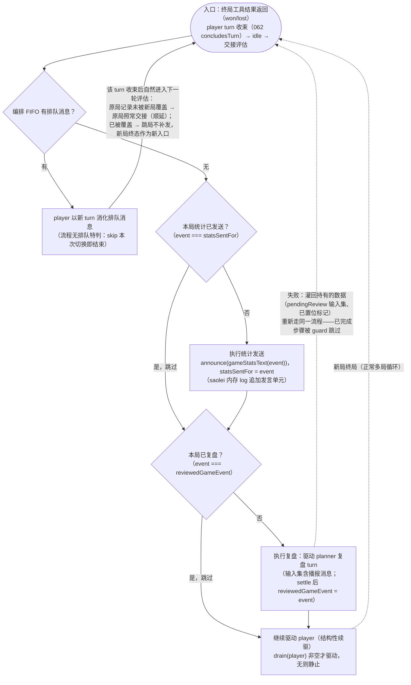

# Contract: 扫雷系统终局统计播报（运行时计数 → 编排触发 → 宿主落地）

**Feature**: specs/065-agent-v2-team-refine/spec.md（FR-001/FR-002/FR-003/FR-005，US1/US2）
**实现锚点**: `common/js/dsh-plugins/saolei-loop/src/{announcer.ts,orchestrator.ts,game/{runtime,board,text}.ts}`、`projects/game/agent_v2/src/{session,history}.ts`
**依赖契约**: [team-member-source.md](team-member-source.md)（成员消息源接口——扫雷系统成员是该接口的非 agent 实现者）；`specs/062-team-game-end-handoff/spec.md`（终局收束与交接优先序——零改动基线）

## §1 每局分项计数（GameRuntime）

1. `GameRuntimeService` 维护 `operationsByType: Record<OperationType, number>`（`click`/`flag`/`chord` 三键，初始 0）。
2. 递增点：`executeOperation` 返回 `kind === "ok"` 时按 `op.type` 递增——与 `operationCount` **同点同口径**：SKIP（无害 no-op）、STOP（结构性拒绝）、桌面派发失败（isError）、init/remain 一律不计；批量调用按其中实际成功执行的单个操作计。**不变量：分项之和 === operationCount**。
3. 清零点：`init` 成功识别新局时（与 `initState`/`operationCount`/`gameLog` 同点）。
4. 携带：`computeGameStats(initState, finalState, operationCount, operationsByType)`——`GameStats` 增 `operationsByType` 字段；随 `GameEventRecord.stats` 终局携带。`GameEventRecord` 顶层形状不变（`status`/`stats`/`endedAt`）。

## §2 统计消息文本（`gameStatsText`）

`common/js/dsh-plugins/saolei-loop/src/game/text.ts` 新增纯函数：

```ts
function gameStatsText(record: GameEventRecord): string;
// 输出（确定性，无不稳定字段）：
// 本局游戏结束：胜利|失败。
// 本局共执行 {operationCount} 个操作：click {c} 次、flag {f} 次、chord {h} 次。
```

`won` → `胜利`，`lost` → `失败`；计数取 `record.stats`。

## §3 扫雷系统成员（SaoleiSystemMember）与编排触发

**成员实现**（`common/js/dsh-plugins/saolei-loop/src/announcer.ts`）：

```ts
/** 扫雷系统成员：TeamMemberSource 的非 agent 实现者（announce-only）。 */
class SaoleiSystemMember {
  readonly source: TeamMemberSource;   // id = `${session}/saolei`；events = 内存 log；
                                       // subscribe = 产出通知；无 sectionTarget；consumes = false
  /** 追加一条播报：向 log 追加 assistant/message 形态事件（唯一 MessageId、单 text block），同步通知订阅者。 */
  announce(text: string): void;        // text 非空校验（fail-loud）
}
```

- log 为**进程内存态**，生命周期 = team 物化（刷新 dispose 即清、重启即失）——与 agent 成员 log 实际行为对齐（2026-09-15 裁定，research.md D9）；`events` 由成员自持，未来加持久化 store 不动 team。
- 事件形态：`{type: "assistant/message", seq, time, data: {turn, step, message}}`——`message` 经 `createAssistantMessage` 构造（唯一 MessageId、单 text block；构造入参传合成 provider/model——入参不含 `kind`，构造后 `AssistantMessage.source` 为必填 `{kind: "model", provider, model}`）；`turn`/`step` 固定占位（派生/渲染只读 `id/content/time/seq`）。词汇表兼容即派生同权（[team-member-source.md](team-member-source.md) §2），不构造 turn/step 边界、不写 dsh session（构造同构于既有测试 `common/js/dsh-plugins/team/src/team.test.ts`）。

**编排触发**（orchestrator）：

1. 物化注册三项成员（player/planner 经 `agentMemberSource` 适配 + saolei 成员），role `saolei`、summary `SAOLEI_MEMBER_SUMMARY = "扫雷系统，终局播报对局结果与操作统计"`（常量并经 `index.ts` 导出）。
2. 触发点：`nextStep()` case 4 命中 `peekGameEvent() !== null && event !== reviewedGameEvent` 时，**先**播报再 `drain(planner)`：

```text
if (event !== this.statsSentFor) {
  this.saolei.announce(gameStatsText(event));   // log 追加 → 派生在 drain 时拾取
  this.statsSentFor = event;
}
const relays = this.drain(members.planner);      // 必含播报单元（排在 player relays 之后）
```

3. **exactly-once（记录恒等，非布尔标记）**：`statsSentFor`（`GameEventRecord | null`）与 `reviewedGameEvent`（既有）同为**对象恒等**判据——`peekGameEvent()` 返回的当前最新终局记录 === 对应标记（最后已播报/已复盘记录）时跳过该动作，新记录（新局终态覆盖）则触发。置位时机：`statsSentFor` 在 announce 时、`reviewedGameEvent` 在复盘驱动成功 settle 后——中间窗口（播报已发、复盘在途或失败）由 case 2 `pendingReview` 短路 + `statsSentFor` guard 双重保证不重发；两标记随物化重置。`reviewedGameEvent` 命中跳过复盘后落入 player 续驱分支（drain 非空才续驱，否则静止）。
4. **排队优先序（FR-003 / US2）**：case 1 排队消化优先保持——队列非空时 player 先消化、播报随交接顺延；消化驱动 player 开新局且终局记录被覆盖 → 旧记录播报条件永不再满足（跳局不补发），新局交接时对新记录播报。取消（paused 短路 pump）与刷新（dispose 清态）语义零改动。
5. **行为增强**：播报后 planner drain 必非空 → 存在未复盘终局记录时复盘保证启动（原 `relays.length === 0` 落入 player 续驱的分支对该场景不再可达）。
6. **访问器**：`orchestrator.announcer: SaoleiSystemMember | undefined`（物化后有值）——宿主订阅其产出的读取面（镜像 `orchestrator.member(role)` 模式）。
7. **不变量保持**：编排不合成 LLM 成员驱动消息（059 FR-009/010 在"系统角色经成员消息源接口提供消息"意义上保持）；驱动输入仍 = drain 结果 + 排队用户消息。

**交接流程图**（线性主干 + 幂等跳过；正常流程与恢复流程同构——恢复即灌回持有的状态〔`pendingReview` 输入集与已置位标记〕后重新执行，已完成步骤被 guard 跳过）：



## §4 宿主落地（session/history）

1. `TeamSessions.doMaterialize` 在 orchestrator 物化成功后经 `orchestrator.announcer` 订阅其产出事件，逐条调用 `TeamHistory.appendAnnouncement(role, text)`——从事件 message content 提取 text block；退订随 entry teardown。
2. `TeamHistory.appendAnnouncement(role: string, text: string): TeamMergeEntry`：`ROLE_AGENT` + 单 text block + `appendMerge(member=role)`——merge 入列（`ListTeamMessages` 可见）+ `team_message{member, message, seq}` 帧扇出（与既有条目同源同值）。`appendMerge` 的 member 参数类型放宽为 `string`（`TeamMergeEntry.member` 本为 string）。
3. 成员视图：消费成员经既有 `member_view` 路径记 `user: [saolei] …`（无新通路）。
4. **proto 面零改动**：`TeamMessage.member` 为 string；`GetTeam.members`/`active_member` 不含 `saolei`（UpdateTeam 两成员校验不变）；web 前端零改动（wire 角色串直接渲染）。

## §5 验收面（对应 spec FR-002/FR-003/FR-004/FR-005、SC-001/SC-002）

单测：

- runtime：分项计数（批量多操作、SKIP/STOP/派发失败不计、init 清零、分项和=总数）；`gameStatsText` 模板（won/lost、计数字段）。
- announcer：announce 追加 log 事件 + 通知订阅者；source 能力位（announce-only、无 sectionTarget）；text 空校验。
- orchestrator：case 4 announce 先于 drain（复盘输入集末位为播报消息）；同记录不重复 announce；队列非空先消化不播报；跳局（记录覆盖）后只对新记录播报；dispose 后不播报；注册第三成员（role/summary/适配器）。
- 宿主：appendAnnouncement 落 merge + 帧；订阅在物化后建立、teardown 退订。

大型测试（fake-llm + fake-desktop，`projects/game/testplan/`）：

- 每局交接后团队归并序列恰有一条 `member="saolei"` 统计消息，数值与该局 fake-desktop 成功派发序列一致（含批量按单个操作计对照）；planner 复盘输入含该消息（fake-llm review 规则 keywords 命中统计模板关键行）；player 成员视图含该广播；`GetTeam` 面不含 `saolei`。
- 排队跳局：终局后有排队消息 → player 消化开新局 → 被跳过局无统计消息、新局交接恰一条新局统计。
