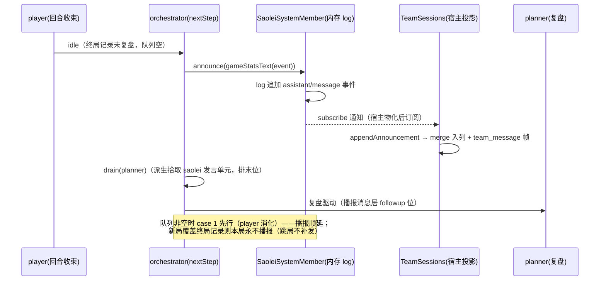

# Data Model: agent-v2-team-refine

**Feature**: specs/065-agent-v2-team-refine/spec.md
**契约**: [contracts/team-member-source.md](contracts/team-member-source.md) · [contracts/game-stats-broadcast.md](contracts/game-stats-broadcast.md) · [contracts/memory-snapshot-recency.md](contracts/memory-snapshot-recency.md)
**现状基线**: `specs/059-agent-v2-team-mode/data-model.md`（team 编排/历史模型）、`specs/062-team-game-end-handoff/data-model.md`（终局收束）——本文件只记录增量实体与变更字段。

## 1. 实体（增量）

### 1.1 成员消息源（TeamMemberSource）— team 插件拥有的接口

| 字段 | 类型 | 说明 |
|---|---|---|
| `id` | string | 稳定成员标识：team 映射键、广播 sender 键（agent 成员 = 其 dsh session id） |
| `events` | `readonly SessionEvent[]` | 成员产出 log（共享事件词汇表，只读快照语义） |
| `subscribe?` | `(onEvent) => () => void` | 产出实时通知（可选；drain 时派生是读权威，live 仅为优化与投影订阅面） |
| `sectionTarget?` | `{section(spec)}` | team section 注入目标（可选；缺省 = 无 prompt 注入） |
| `consumes?` | boolean（缺省 true） | `false` = announce-only：不接收 relay、不建 pending、不可 drain |

- **依赖倒置点**：team 只认"成员 = 消息源"；agent 与非 agent 成员（扫雷系统）都是该接口的实现者，产出经**完全相同**的派生/渲染/消费闭包路径。
- **agent 适配器**（team 导出）：`agentMemberSource(handle)` ——id/events/subscribe/sectionTarget/consumes 全部映射自 AgentHandle，现有语义零变化。
- **派生同权**：`deriveUnits`/`consumedAnchors`/`renderBroadcast` 改读 `source.events`，逻辑不变——`assistant/message` 形态产出即发言单元。

### 1.2 扫雷系统成员（SaoleiSystemMember）— saolei-loop 所有

| 字段/方法 | 类型 | 说明 |
|---|---|---|
| `source` | TeamMemberSource | `id = ${session}/saolei`（与 `${session}/player`、`${session}/planner` 命名同构；不是 dsh session，仅标识）；`events` = 内存 log；`subscribe` = 产出通知；无 `sectionTarget`；`consumes = false` |
| `announce(text)` | `(text: string) => void` | 向 log 追加一条 `assistant/message` 形态事件（构造形态见下方 log 事件形态）并同步通知订阅者；text 非空校验（fail-loud） |

- **log 事件形态**：`{type: "assistant/message", seq, time, data: {turn, step, message}}`——`message` 经 `createAssistantMessage` 构造（唯一 MessageId、单 text block；构造入参传合成 provider/model——入参不含 `kind`，构造后 `AssistantMessage.source` 为必填 `{kind: "model", provider, model}`）；`turn`/`step` 固定占位（派生/渲染只读 `id/content/time/seq`，两者不被读取）。词汇表兼容即派生同权（§1.1），不构造 turn/step 边界、不写 dsh session（构造同构于既有测试 `common/js/dsh-plugins/team/src/team.test.ts` 的 `data: {turn: 1, step: 1, message}`）。
- **生命周期**：进程内存态、随 team 物化（刷新 dispose 即清、重启即失）——与 agent 成员 log 实际行为对齐（2026-09-15 裁定，research.md D9）；`events` 由成员自持，未来加持久化 store 不动 team。
- **注册信息**（saolei-loop 常量并导出）：`role = "saolei"`、`SAOLEI_MEMBER_SUMMARY = "扫雷系统，终局播报对局结果与操作统计"`——以常规 announce-only 成员注册进 `members`，roster 自然渲染三行；不进 proto `TeamMember` 成员列表与 `active_member`。

### 1.3 每局分项操作统计 — `GameStats` 扩展

| 字段 | 类型 | 说明 |
|---|---|---|
| `operationsByType` | `Record<OperationType, number>` | click/flag/chord 各自的**成功派发**计数；分项之和恒等于 `operationCount` |

- **维护点**：`GameRuntimeService` 每局内态；`init` 清零（与 `operationCount`/`gameLog` 同点）；`executeOperation` 返回 `kind === "ok"` 时按 `op.type` 递增。
- **携带**：`computeGameStats` 扩展签名接收该表；随 `GameEventRecord.stats` 终局携带（`GameEventRecord` 形状不变）。
- **口径**（与 `operationCount` 一致）：SKIP（无害 no-op）与 STOP（结构性拒绝）不计；桌面派发失败（isError）不计；init/remain 调用不计；批量调用按其中实际成功执行的单个操作计。

### 1.4 统计消息（team 消息流的 wire 投影）— 宿主侧

| 字段 | 值 |
|---|---|
| merge `member` | `"saolei"`（wire 角色串，string） |
| `HistoryMessage.role` | `ROLE_AGENT` |
| blocks | 单个 text block（模板正文） |
| `seq` | 既有 `TeamHistory` 单调 seq（与 user/成员消息同源同值） |
| 帧扇出 | `team_message{member="saolei", message, seq}`（实时）；ListTeamMessages 回填同条目 |

- 成员视图：消费成员的 log 内为 `user/message`（`source {kind: "team-broadcast", role: "saolei", senderSessionId: "…/saolei", messageId: 发言锚}`）→ `MemberViewEntry {sender: "saolei"}` + `member_view` 帧（既有路径，非新通路）。
- **不变量**：每个被交接的局至多一条（编排 `statsSentFor` guard + MessageId 唯一）；`GetTeam.members`/`active_member` 不含 `saolei`。

### 1.5 记忆列表排序 — ListMemories 通用排序机制（memory 服务）+ 快照单页装载（JS 客户端）

契约：[contracts/memory-snapshot-recency.md](contracts/memory-snapshot-recency.md) §1–§2（对象关系与值转换责任总图见其 §1 item 9 classDiagram）。排序是一套通用机制（语法 → 白名单映射 → 指定 tie-breaker 收尾 → 通用游标 → 单路径仓储直译），不为单个排序需求定制、不按排序键数量分支；**全部校验收敛在 domain 层，仓储收到已验证输入只做直译**（2026-09-16 第三次裁定：实现形态以 Go 习惯为锚；第四次裁定：seek 条件任意键数统一 OR 阶梯、游标 struct 包装；第五次裁定：填补判据 = 请求排序字段完全不含 `memory_id`（任意位置合法）、游标全链指针化（nil = 首页）、值转换单次化与责任收敛 domain（wire↔typed 往返收敛在 term 对称方法、仓储零转换）、seek O(n) 增量构造）。

| 实体 | 位置 | 说明 |
|---|---|---|
| `ListMemoriesRequest.order_by` | `projects/game/game.proto` | `string order_by = 4`（AIP-132）：逗号分隔 `{field} [desc]` 列表、空白不敏感、升序省略后缀、白名单字段任意键位合法；缺省 = 空白早返回固定默认值 `[memory_id asc]`（语义同"空键列表 + 填补规则"，无特设分支） |
| `MemorySortTerm` | `projects/game/memory/domain/sort.go` | **自包含最终排序键元素** `{Field, MongoField string; Descending bool}`（另携包内私有 kind 与**一对对称值转换方法**：`CursorValue(value string) (any, error)`（wire → typed）/ `CursorEntry(value any) *MemoryCursorEntry`（typed → entry，时间 UTC RFC3339Nano 格式化唯一所在；kind/类型不匹配 panic fail-fast）——值转换的单一知识源）；`ParseMemoryOrderBy(orderBy) ([]*MemorySortTerm, error)`：空白早返回；两趟处理——校验趟逐项校验（语法+白名单+重复）并填 `validated map[string]*MemorySortTerm`（term 唯一存放；失败即 `(nil, error)` 无部分产出），排序趟再过 items 按原序取 term——map 完全不含 `memory_id` 才追加 tie-breaker；`ListMemories` 仓储签名 `(sort []*MemorySortTerm, cursor *MemoryPageCursor, pageSize)` |
| 白名单 `memorySortFieldSpec` | `projects/game/memory/domain/sort.go` | 包内私有单一事实源映射表 `[]*memorySortFieldSpec{Field, MongoField, kind}`（**无 Unique 标志**——tie-breaker 为指定字段 `memory_id`，非行属性扫描）；首期 `memory_id`（指定 tie-breaker）+ `update_time`（业务字段）；键数无上界——新增业务字段即 3+ 键，解析与 seek 阶梯零改动（仅 accessor/索引义务） |
| `MemoryPageCursor` | `projects/game/memory/domain/pagination.go` | 通用游标 = **struct 包装单一 wire 形态 + 指针签名 + typed 双形态**：`type MemoryPageCursor struct { Entries []*MemoryCursorEntry \`json:"entries"\` }`、`MemoryCursorEntry{Field, Value string}`（json tag 直接标注，无指针字段、无中间转换层；另携包内私有 `typed any`（json 不可见）+ 导出 `Typed() any`）；跨函数边界一律 `*MemoryPageCursor`，**nil = 首页唯一判据**（空 token → handler 传 nil；非 nil cursor 携非空且 typed 就绪 Entries——Decode 产物契约）；`EncodeMemoryPageToken(cursor *MemoryPageCursor) string` **全函数**（nil 或空 Entries → 空 token；base64url(NoPadding) JSON 对象 `{"entries":[...]}`）；`DecodeMemoryPageToken(token, sort) (*MemoryPageCursor, error)`（成功恒非 nil；解码 + 与最终键匹配 + 逐 entry 经 `CursorValue` **一次完成校验与转换**（typed 存入 entry）；跨序重放/坏 token/顶层非对象 → `ErrInvalidPageToken` → INVALID_ARGUMENT，AIP-158 参数一致）；不编码方向（方向由续页 `order_by` 推导）；演进 = struct 加字段（json tag），签名不变 |
| Mongo 单路径查询 | `projects/game/memory/runtime/mongo` | 已验证输入**直译 + 零 string↔typed 转换**一套流程：`memorySortDocument(sort)`（MongoField × 方向）→ `cursor != nil` 时 seek 条件**通用 OR 阶梯 O(n) 增量构造**（`memorySeekClauses(sort, cursor) bson.A` 无 error 返回——等值前缀逐键演进（每键一次等值化 O(1) 摊还），第 i 子句 = 前缀浅拷贝（独立 `bson.M`，值为不可变标量）+ 当前键方向 `$gt/$lt` 比较（`entry.Typed()` 原样入 bson），emit 后尾项退化为等值汇入前缀；统一赋 `filter["$or"]`；单键 = 单子句，无长度分支、无从零重建）→ limit+1 → 页满 entries 经 `term.CursorEntry(doc.sortValue(term.Field))` 构造 + 指针编码 next token；`memoryDocument.sortValue(field) any` **typed accessor**（memory_id → string、update_time → `time.Time`，零格式化；未知字段 panic）——wire 格式化唯一所在为 domain `CursorEntry`；启动建非唯一索引 `{template: 1, session_id: 1, update_time: -1, memory_id: 1}`（唯一索引 `(template, session_id, memory_id)` 支撑缺省序）；索引义务：新增字段 = 一行映射 + 一行 accessor + 按消费方向建复合索引（seek 构造零改动） |
| `listMemories` options | `common/js/dsh-plugins/memory-service/src/client.ts` | 可选 `{orderBy?, pageSize?}`；`pageSize` 给定 → 单页即止，未给定 → 全页累积（写路径现行为）。`MemoryEntry` 仅 `{memory_id, content}` |
| 快照装载/渲染 | `common/js/dsh-plugins/memory-service/src/{service,snapshot}.ts` | `load` 以 `{orderBy: "update_time desc", pageSize: 10}` 单页取最近 10 条（`SNAPSHOT_ORDER_BY`/`SNAPSHOT_ENTRY_LIMIT` 常量归 snapshot.ts）；`renderMemorySnapshot` 纯透传渲染（`memory_id` 永不渲染、空集空串——既有语义） |

- **快照序**：最近更新的 ≤10 条、最新在前、确定（同毫秒并列以 `memory_id` 升序打破——收尾规则）——由服务端排序保证，客户端不排序/截断。
- **零变化面**：memory 工具写路径（`applyMemoryCall` 的 old_text 定位面向全量存储、不传 order_by）、快照冻结时机（物化预取、实例生命周期固定）、前端、JS/testplan 消费面（`order_by` 对外语义面唯一变化 = 曾因"`memory_id` 非末位"被拒绝的键列表转为合法——消费面无依赖；token 对外 opaque、只透传——内部 JSON 形态为 struct 包装对象 `{"entries":[...]}`，全消费面不解析，零影响）；缺省（空白 `order_by`）排序结果与翻页语义同前，`next_page_token` 形态为通用编码（不透明、客户端只透传）。

## 2. 状态转移（终局交接路径增量）



关键转移规则（含既有不变量的增量影响）：

1. **播报条件**：case 4 命中 `peekGameEvent() !== null && !== reviewedGameEvent`，且 `statsSentFor !== 该记录`（对象恒等）。
2. **复盘保证启动**：播报后 planner 的 drain 必含 saolei 发言单元 → 原"`relays.length === 0` 不启动复盘、落入 player 续驱"的分支在存在未复盘终局记录时不再可达。
3. **重试安全**：复盘驱动失败 → `pendingReview` 持有含播报消息的输入集重试（case 2 短路 case 4）→ 无二次播报；log 与历史各一条。
4. **跳局**：排队消化驱动 player 开新局、终局记录被覆盖 → 旧记录的播报条件永不再满足 → 不补发；新局交接时对新记录播报。
5. **取消/刷新**：paused 短路 pump（播报顺延至恢复后交接）；dispose 清编排与成员 log（未交接局不再播报）。

## 3. 统计消息文本模板（终态）

`gameStatsText(record: GameEventRecord): string`（saolei-loop 所有，纯函数）：

```text
本局游戏结束：{胜利|失败}。
本局共执行 {operationCount} 个操作：click {click} 次、flag {flag} 次、chord {chord} 次。
```

- `{胜利|失败}` ← `record.status`（`won` → 胜利，`lost` → 失败）；计数 ← `record.stats.operationsByType` 与 `record.stats.operationCount`。
- 确定性纯文本（无时间戳/局号等不稳定字段）；模型与用户双可读。
